# TÀI LIỆU ĐẶC TẢ YÊU CẦU PHẦN MỀM (SRS)

> [!NOTE]
> Tài liệu này thuộc Đồ án Tốt nghiệp kỹ sư/cử nhân Công nghệ Thông tin. Mọi thông tin sao chép phải tuân thủ quyền tác giả.

## Thông tin dự án
- **Tên dự án**: Nền tảng Phân tích và Tối ưu SEO/Hiệu suất Website tự động (SEO-Auto-V2)
- **Phiên bản**: 3.0
- **Ngày lập**: 03/08/2026
- **Tác giả**: Nhóm phát triển dự án

### Lịch sử phiên bản (Version History)

| Phiên bản | Ngày | Người cập nhật | Mô tả thay đổi |
| :---: | :--- | :--- | :--- |
| 1.0 | 01/06/2026 | Nguyễn Văn A | Khởi tạo tài liệu dự thảo ban đầu |
| 1.5 | 15/07/2026 | Trần Thị B | Bổ sung kiến trúc Microservices và luồng Message Broker |
| 2.0 | 03/08/2026 | Nhóm Phát triển | Hoàn thiện đặc tả kiến trúc tổng thể, sơ đồ luồng dữ liệu |
| 3.0 | 03/08/2026 | Nhóm Phát triển | Mở rộng quy mô: thêm 6 microservices mới (Subscription, Team, Scheduler, Crawler, Keyword, Integration), 31 functional requirements bổ sung, 75+ API endpoints mới, 30+ bảng database mới |

---

## Mục lục (Table of Contents)
1. [Giới thiệu chung](#1-giới-thiệu-chung)
   - 1.1. Mục đích tài liệu
   - 1.2. Phạm vi dự án (Project Scope)
   - 1.3. Đối tượng đọc tài liệu
   - 1.4. Định nghĩa, thuật ngữ viết tắt và từ ngữ chuyên ngành (Glossary)
   - 1.5. Tài liệu tham chiếu (References)
2. [Mô tả tổng quan hệ thống](#2-mô-tả-tổng-quan-hệ-thống)
   - 2.1. Bối cảnh và Động lực phát triển
   - 2.2. Tầm nhìn sản phẩm (Product Vision)
   - 2.3. Đối tượng sử dụng (User Classes & Characteristics)
   - 2.4. Môi trường hoạt động (Operating Environment)
   - 2.5. Ràng buộc thiết kế và triển khai (Design Constraints)
   - 2.6. Giả định và Phụ thuộc (Assumptions & Dependencies)
3. [Kiến trúc hệ thống (System Architecture)](#3-kiến-trúc-hệ-thống-system-architecture)
   - 3.1. Kiến trúc tổng quan (High-Level Architecture)
   - 3.2. Mô tả các Microservice
   - 3.3. Luồng dữ liệu tổng quan (Data Flow)
   - 3.4. Kiến trúc triển khai (Deployment Architecture)
4. [Yêu cầu chức năng chi tiết](#4-yêu-cầu-chức-năng-chi-tiết-detailed-functional-requirements)
   - 4.1. Phân hệ Xác thực & Quản lý Người dùng (FR-101 → FR-108)
   - 4.2. Phân hệ Tiện ích mở rộng Chrome Extension (FR-201 → FR-206)
   - 4.3. Phân hệ Thu thập & Đánh giá Audit (FR-301 → FR-306)
   - 4.4. Phân hệ Phân tích AI (FR-401 → FR-405)
   - 4.5. Phân hệ Báo cáo (FR-501 → FR-506)
   - 4.6. Phân hệ Thông báo & Cảnh báo (FR-601 → FR-605)
   - 4.7. Phân hệ Quản trị hệ thống (FR-701 → FR-704)
   - 4.8. Phân hệ Gói dịch vụ & Thanh toán (FR-801 → FR-807)
   - 4.9. Phân hệ Nhóm & Tổ chức (FR-901 → FR-906)
   - 4.10. Phân hệ Lập lịch & Tự động hóa (FR-1001 → FR-1005)
   - 4.11. Phân hệ Thu thập Toàn site - Site Crawler (FR-1101 → FR-1106)
   - 4.12. Phân hệ Theo dõi Từ khóa (FR-1201 → FR-1205)
   - 4.13. Phân hệ Tích hợp Bên ngoài (FR-1301 → FR-1306)
5. [Yêu cầu phi chức năng chi tiết](#5-yêu-cầu-phi-chức-năng-chi-tiết-non-functional-requirements)
   - 5.1. Hiệu năng (NFR-001 → NFR-005)
   - 5.2. Khả năng mở rộng (NFR-006 → NFR-008)
   - 5.3. Độ tin cậy & Khả dụng (NFR-009 → NFR-013)
   - 5.4. Bảo mật (NFR-014 → NFR-020)
   - 5.5. Khả năng bảo trì (NFR-021 → NFR-024)
   - 5.6. Khả năng tương thích (NFR-025 → NFR-027)
   - 5.7. Khả năng triển khai (NFR-028 → NFR-030)
6. [Đặc tả API](#6-đặc-tả-api-api-specification)
   - 6.1. Identity Service API
   - 6.2. Audit Service API
   - 6.3. Report Service API
   - 6.4. Notification Service API
   - 6.5. Admin API
   - 6.6. API Endpoints mở rộng — Các Microservice bổ sung
   - 6.7. API Endpoints bổ sung cho các Service hiện tại
7. [Thiết kế Cơ sở dữ liệu](#7-thiết-kế-cơ-sở-dữ-liệu-database-design)
   - 7.1. Sơ đồ ERD tổng quan (Identity, Audit, AI, Report, Notification)
   - 7.2. Mô tả chi tiết các bảng
   - 7.3. Index Strategy
   - 7.4. Cơ sở dữ liệu mở rộng (Subscription, Team, Scheduler, Crawler, Keyword, Integration)
8. [Thiết kế Giao diện Người dùng](#8-thiết-kế-giao-diện-người-dùng-uiux-design)
9. [Ma trận Truy vết Yêu cầu](#9-ma-trận-truy-vết-yêu-cầu-requirements-traceability-matrix)
10. [Kế hoạch Kiểm thử](#10-kế-hoạch-kiểm-thử-testing-strategy)
11. [Phụ lục](#11-phụ-lục-appendices)

---

## 1. Giới thiệu chung

### 1.1. Mục đích tài liệu
Tài liệu Đặc tả Yêu cầu Phần mềm (Software Requirements Specification - SRS) này nhằm mục đích mô tả chi tiết, rõ ràng và đầy đủ các yêu cầu chức năng, phi chức năng, và kiến trúc hệ thống của dự án **SEO-Auto-V2**. Tài liệu là cầu nối giữa các bên liên quan, bao gồm khách hàng (người sử dụng), nhà phân tích hệ thống, lập trình viên, và chuyên viên kiểm thử, đảm bảo sự đồng thuận về các tính năng cần được xây dựng trước khi bước vào giai đoạn thiết kế và lập trình.

### 1.2. Phạm vi dự án (Project Scope)
Dự án **SEO-Auto-V2** phát triển một nền tảng SaaS (Software as a Service) cung cấp giải pháp tự động hóa quá trình phân tích, đánh giá, và đưa ra các đề xuất tối ưu hóa Tối ưu hóa Công cụ Tìm kiếm (SEO) và Hiệu suất (Performance) của website.
Phạm vi của hệ thống bao gồm:
- Cung cấp giao diện quản trị (Dashboard) dưới dạng web application để người dùng cấu hình chiến dịch kiểm tra.
- Phát triển Chrome Extension giúp người dùng phân tích nhanh URL đang truy cập.
- Tích hợp với **Google PageSpeed Insights API** để lấy dữ liệu Core Web Vitals thực tế và phòng thí nghiệm (field & lab data).
- Tích hợp với **Gemini AI API** để sinh ra các báo cáo tự nhiên, phân tích nâng cao, và đề xuất mã nguồn khắc phục lỗi.
- Kiến trúc hệ thống mở rộng và phân tán bằng .NET Microservices, liên lạc qua RabbitMQ.

### 1.3. Đối tượng đọc tài liệu
- **Giảng viên Hướng dẫn & Hội đồng bảo vệ**: Hiểu rõ quy mô, độ phức tạp và hướng giải quyết của đồ án.
- **Project Manager / Scrum Master**: Lập kế hoạch dự án, theo dõi tiến độ dựa trên các yêu cầu cụ thể.
- **Developers (Frontend / Backend)**: Dựa vào các yêu cầu và thiết kế kiến trúc để xây dựng mã nguồn.
- **QA / Testers**: Lập test plan, test cases nhằm kiểm thử, xác nhận hệ thống có đáp ứng các tiêu chí được đề ra hay không.
- **DevOps Engineers**: Nắm vững cấu trúc kiến trúc microservices để cấu hình CI/CD, Docker, và hạ tầng đám mây.

### 1.4. Định nghĩa, thuật ngữ viết tắt và từ ngữ chuyên ngành (Glossary)

| Thuật ngữ | Định nghĩa / Giải thích |
| :--- | :--- |
| **SRS** | Software Requirements Specification - Đặc tả Yêu cầu Phần mềm. |
| **SaaS** | Software as a Service - Phần mềm được phân phối dưới dạng dịch vụ trên nền tảng đám mây. |
| **API** | Application Programming Interface - Giao diện lập trình ứng dụng. |
| **JWT** | JSON Web Token - Chuẩn mở mã hóa để xác thực an toàn thông tin người dùng. |
| **OAuth2** | Giao thức ủy quyền chuẩn công nghiệp, sử dụng trong xác thực của Google, Facebook. |
| **CORS** | Cross-Origin Resource Sharing - Cơ chế bảo mật giới hạn việc chia sẻ tài nguyên giữa các domain. |
| **REST** | Representational State Transfer - Kiến trúc thiết kế các Web Services trên nền HTTP. |
| **gRPC** | Hệ thống gọi thủ tục từ xa (RPC) hiệu năng cao, nguồn mở của Google. |
| **Core Web Vitals** | Các chỉ số thiết yếu của Google đo lường trải nghiệm người dùng trên website (LCP, INP, CLS). |
| **LCP** | Largest Contentful Paint - Chỉ số đo thời gian render phần tử nội dung lớn nhất trên màn hình (Hiệu năng tải trang). |
| **INP** | Interaction to Next Paint - Chỉ số mới thay thế FID (First Input Delay), đo lường khả năng phản hồi tương tác toàn trang. |
| **CLS** | Cumulative Layout Shift - Chỉ số đo lường sự dịch chuyển bố cục trang ngoài ý muốn (Độ ổn định thị giác). |
| **TTFB** | Time to First Byte - Thời gian phản hồi ban đầu của server. |
| **FCP** | First Contentful Paint - Thời gian xuất hiện phần nội dung đầu tiên trên trình duyệt. |
| **SEO** | Search Engine Optimization - Tối ưu hóa công cụ tìm kiếm. |
| **CDN** | Content Delivery Network - Mạng phân phối nội dung, tăng tốc tải trang toàn cầu. |
| **SSL/TLS** | Secure Sockets Layer / Transport Layer Security - Giao thức mã hóa an toàn trên internet (HTTPS). |
| **CI/CD** | Continuous Integration / Continuous Deployment - Tích hợp và Triển khai liên tục. |
| **Docker** | Nền tảng container hóa, giúp đóng gói ứng dụng độc lập với môi trường. |
| **Kubernetes** | Nền tảng tự động hóa triển khai, mở rộng và quản lý các ứng dụng container hóa. |
| **RabbitMQ** | Message Broker - Trình môi giới tin nhắn sử dụng giao thức AMQP. |
| **Redis** | In-memory data structure store, dùng làm database, cache và message broker. |
| **PostgreSQL** | Hệ quản trị cơ sở dữ liệu quan hệ mạnh mẽ, mã nguồn mở. |
| **YARP** | Yet Another Reverse Proxy - Reverse Proxy hiệu năng cao do Microsoft phát triển dùng trong .NET. |
| **MassTransit** | Thư viện Message Bus cho .NET, giúp giao tiếp với RabbitMQ dễ dàng. |
| **Vertical Slice Architecture** | Kiến trúc theo "lát cắt dọc", chia hệ thống theo các feature riêng biệt thay vì theo layer (tầng). |
| **CQRS** | Command Query Responsibility Segregation - Kiến trúc tách biệt việc đọc (Query) và ghi (Command) dữ liệu. |
| **DDD** | Domain-Driven Design - Thiết kế hướng miền nghiệp vụ. |
| **Rate Limiting** | Cơ chế giới hạn tần suất gửi request tới API nhằm chống tấn công DoS/Brute-force. |
| **WebSocket** | Giao thức giao tiếp hai chiều thời gian thực (Full-duplex) qua một TCP connection duy nhất. |
| **PWA** | Progressive Web App - Ứng dụng web tiến bộ, có khả năng hoạt động offline giống native app. |

### 1.5. Tài liệu tham chiếu (References)
- [1] IEEE Std 830-1998, *IEEE Recommended Practice for Software Requirements Specifications*.
- [2] Google PageSpeed Insights API Documentation: https://developers.google.com/speed/docs/insights/v5/get-started
- [3] Google Core Web Vitals Guidelines: https://web.dev/vitals/
- [4] Gemini API Documentation: https://ai.google.dev/docs
- [5] RabbitMQ Documentation: https://www.rabbitmq.com/documentation.html
- [6] MassTransit Documentation: https://masstransit-project.com/
- [7] Microsoft YARP Documentation: https://microsoft.github.io/reverse-proxy/

---

## 2. Mô tả tổng quan hệ thống

### 2.1. Bối cảnh và Động lực phát triển
Ngày nay, tốc độ tải trang (Web Performance) và Tối ưu công cụ tìm kiếm (SEO) đóng vai trò sống còn trong việc thu hút người dùng và tăng tỷ lệ chuyển đổi. Tuy nhiên, việc đánh giá SEO bằng các phương pháp truyền thống rất tốn thời gian. Các webmaster, nhân viên SEO phải thủ công nhập từng URL vào Google PageSpeed Insights, đọc và phân tích các chỉ số phức tạp, rồi mất thêm thời gian tìm cách khắc phục mã nguồn.

> [!TIP]
> Việc áp dụng AI vào quá trình đọc hiểu lỗi và tự động đưa ra các đoạn code khắc phục sẽ giải quyết "nút thắt cổ chai" trong công việc của các SEOer không chuyên về kỹ thuật.

Dự án **SEO-Auto-V2** ra đời nhằm giải quyết những *pain points* (nỗi đau) đó:
- Tự động hóa quá trình quét hàng loạt các trang web.
- Phiên dịch các chỉ số kỹ thuật khô khan (LCP, CLS, INP) thành ngôn ngữ tự nhiên và báo cáo chi tiết thông qua Gemini AI.
- Cung cấp tiện ích mở rộng trên trình duyệt để audit website "on-the-fly".

### 2.2. Tầm nhìn sản phẩm (Product Vision)
Trở thành nền tảng SaaS hàng đầu trong khu vực cung cấp giải pháp One-Stop SEO Analysis. Khách hàng chỉ cần nhập tên miền; hệ thống tự động phát hiện, phân tích các chỉ số Core Web Vitals, tổng hợp lỗi, và cung cấp giải pháp lập trình (Code snippet) ngay trên báo cáo để tối ưu hóa hiệu suất với sự hỗ trợ của Generative AI.

### 2.3. Đối tượng sử dụng (User Classes & Characteristics)

| Nhóm người dùng | Tần suất sử dụng | Mức độ kỹ thuật | Đặc điểm và Vai trò trên hệ thống |
| :--- | :---: | :---: | :--- |
| **Guest** (Khách) | Thấp | Cơ bản | Chỉ xem trang Landing Page, đăng ký tài khoản hoặc sử dụng thử tính năng Quick Audit qua Extension nhưng bị giới hạn Rate Limit. |
| **Standard User** | Trung bình | Cơ bản / Khá | Người dùng đăng ký miễn phí, phân tích thủ công từng URL một. Xem được điểm hiệu năng tổng quan, nhưng bị giới hạn tính năng AI Suggestion. |
| **Premium User** | Cao | Đa dạng | Khách hàng trả phí, có thể cấu hình Schedule Audit định kỳ (Cronjob), quét hàng nghìn URL, nhận thông báo qua Email/Webhook và sử dụng full tính năng của Gemini AI. |
| **System Admin** | Thấp - Trung bình | Rất Cao | Quản lý hệ thống, cấu hình tham số (Rate Limit, Message Broker), quản trị phân quyền, giám sát logs và sức khỏe các microservices. |

### 2.4. Môi trường hoạt động (Operating Environment)

#### 2.4.1. Client-side
- **Web Dashboard**: Chạy mượt mà trên các trình duyệt hiện đại (Chrome 110+, Firefox 105+, Safari 15+). Yêu cầu thiết kế Responsive.
- **Chrome Extension**: Yêu cầu hỗ trợ Manifest V3 trên Chromium engine (Google Chrome, Microsoft Edge, Brave).

#### 2.4.2. Server-side
- Các backend services phát triển trên nền tảng **.NET 8 (C#)**.
- OS: Linux (Ubuntu Server 22.04 LTS hoặc Alpine Linux cho Docker container).
- Phải được hỗ trợ ảo hóa (Containerization) toàn diện trên nền tảng Docker/Kubernetes.

#### 2.4.3. Database & Caching
- **RDBMS**: PostgreSQL 15+ lưu trữ dữ liệu nghiệp vụ có cấu trúc.
- **Cache & Message Broker**: Redis 7.0+ lưu trữ rate-limit state, distributed caching. RabbitMQ 3.12+ đóng vai trò message broker (AMQP).

### 2.5. Ràng buộc thiết kế và triển khai (Design Constraints)
- Hệ thống áp dụng **Microservices Architecture**, mỗi service quản lý cơ sở dữ liệu riêng lẻ của mình (Database per service). Không truy cập chéo database.
- Liên lạc giữa các service chủ yếu thông qua mô hình Event-Driven (Pub/Sub với RabbitMQ) kết hợp với RPC qua gRPC cho nội dung đồng bộ cần tốc độ cao.
- **YARP** đóng vai trò là single entry point cho mọi request từ frontend, giải quyết CORS, Load Balancing, và Authentication sơ bộ (chặn Un-auth requests trước khi tới service đích).

### 2.6. Giả định và Phụ thuộc (Assumptions & Dependencies)

> [!WARNING]
> Những yếu tố này nằm ngoài tầm kiểm soát của dự án và có thể ảnh hưởng đến tiến độ, độ ổn định của hệ thống.

**Giả định (Assumptions):**
1. Người dùng có kết nối internet băng thông rộng và ổn định để sử dụng hệ thống.
2. Các URL do người dùng cung cấp phải hợp lệ và có thể truy cập public.
3. Người dùng cài đặt tiện ích mở rộng trên trình duyệt hỗ trợ Manifest V3.
4. Token API của Google và Gemini được cấp phát có đủ quota theo tính toán ngân sách ban đầu.
5. Mô hình máy học của Gemini AI không trả về kết quả ảo giác (hallucination) ảnh hưởng tiêu cực tới source code website khách hàng.
6. Máy chủ ảo (VPS) đảm bảo hoạt động liên tục (Uptime 99.9%).
7. Cơ sở dữ liệu phân tán có khả năng eventual consistency (nhất quán cuối) mà không gây nhầm lẫn hiển thị cho người dùng.
8. Email server không chặn các thông báo từ hệ thống như là spam.

**Phụ thuộc (Dependencies):**
1. **Google PageSpeed Insights API**: Phụ thuộc hoàn toàn vào tốc độ phản hồi và giới hạn (Rate Limits) của Google.
2. **Gemini AI API**: Phụ thuộc vào chất lượng mô hình AI sinh tạo từ Google (tốc độ generate text, giá thành per 1000 tokens).
3. Thư viện **MassTransit**: Phụ thuộc vào tương thích thư viện trên nền tảng .NET 8.
4. Framework **Next.js/React**: Phụ thuộc vào hệ sinh thái NPM và các dependencies bảo mật liên quan.
5. Cổng thanh toán (Momo/Stripe - nếu mở rộng): Dựa vào API của bên thứ 3 để nâng cấp tài khoản Premium.
6. Google Chrome Web Store: Việc phát hành Extension bị phụ thuộc vào chính sách xét duyệt nội dung của Google.

---

## 3. Kiến trúc hệ thống (System Architecture)

### 3.1. Kiến trúc tổng quan (High-Level Architecture)
Hệ thống được thiết kế theo mô hình Microservices, phân tán các nghiệp vụ nhằm đảm bảo tính khả mở và fault-tolerance.

```mermaid
flowchart TD
    subgraph Clients
        Dashboard["Next.js Web Dashboard"]
        ChromeExt["Chrome Extension"]
        MobileApp["Mobile PWA (Future)"]
    end

    Gateway{"YARP API Gateway<br/>(Load Balancing, Rate Limit, Auth)"}

    Clients --> |HTTPS / REST API| Gateway
    
    subgraph Core Services
        IdentityService["Identity Service<br/>(Auth, Users, RBAC)"]
        AuditService["Audit Service<br/>(PageSpeed, HTML Analysis)"]
        AiService["AI Service<br/>(Gemini Integration)"]
        ReportService["Report Service<br/>(Aggregates Data, PDF)"]
        NotifService["Notification Service<br/>(SignalR, Email, Push)"]
    end

    subgraph Business Services
        SubService["Subscription Service<br/>(Plans, Billing, Invoices)"]
        TeamService["Team Service<br/>(Organizations, RBAC)"]
        SchedulerService["Scheduler Service<br/>(Cron Jobs, Batch Audit)"]
    end

    subgraph Analysis Services
        CrawlerService["Site Crawler Service<br/>(Deep Crawl, Broken Links)"]
        KeywordService["Keyword Service<br/>(Rank Tracking, Competitors)"]
        IntegrationService["Integration Service<br/>(Webhooks, Slack, GA, GSC)"]
    end

    Gateway -->|Forward| IdentityService
    Gateway -->|Forward| AuditService
    Gateway -->|Forward| ReportService
    Gateway -->|Forward| SubService
    Gateway -->|Forward| TeamService
    Gateway -->|Forward| SchedulerService
    Gateway -->|Forward| CrawlerService
    Gateway -->|Forward| KeywordService
    Gateway -->|Forward| IntegrationService
    
    subgraph Message Broker
        RabbitMQ[("RabbitMQ<br/>(MassTransit Event Bus)")]
    end
    
    IdentityService -.-> |Pub/Sub| RabbitMQ
    AuditService -.-> |Pub/Sub| RabbitMQ
    AiService -.-> |Pub/Sub| RabbitMQ
    ReportService -.-> |Pub/Sub| RabbitMQ
    NotifService -.-> |Pub/Sub| RabbitMQ
    SubService -.-> |Pub/Sub| RabbitMQ
    TeamService -.-> |Pub/Sub| RabbitMQ
    SchedulerService -.-> |Pub/Sub| RabbitMQ
    CrawlerService -.-> |Pub/Sub| RabbitMQ
    KeywordService -.-> |Pub/Sub| RabbitMQ
    IntegrationService -.-> |Pub/Sub| RabbitMQ

    subgraph External APIs
        PSI["Google PageSpeed API"]
        Gemini["Gemini AI API"]
        Stripe["Stripe / VNPay / MoMo"]
        SERP["SERP API (Keyword Rank)"]
        SlackAPI["Slack API"]
        TelegramAPI["Telegram Bot API"]
        GSC["Google Search Console"]
        GA["Google Analytics 4"]
    end
    
    AuditService --> |REST| PSI
    AiService --> |REST| Gemini
    SubService --> |REST| Stripe
    KeywordService --> |REST| SERP
    IntegrationService --> |OAuth2| SlackAPI
    IntegrationService --> |REST| TelegramAPI
    IntegrationService --> |OAuth2| GSC
    IntegrationService --> |OAuth2| GA

    subgraph Databases & Cache
        IdentityDB[(PostgreSQL - Identity)]
        AuditDB[(PostgreSQL - Audit)]
        ReportDB[(PostgreSQL - Report)]
        NotifDB[(PostgreSQL - Notification)]
        SubDB[(PostgreSQL - Subscription)]
        TeamDB[(PostgreSQL - Team)]
        SchedulerDB[(PostgreSQL - Scheduler)]
        CrawlerDB[(PostgreSQL - Crawler)]
        KeywordDB[(PostgreSQL - Keyword)]
        IntegrationDB[(PostgreSQL - Integration)]
        RedisCache[(Redis - Cache & Rate Limit)]
    end

    IdentityService --- IdentityDB
    AuditService --- AuditDB
    ReportService --- ReportDB
    NotifService --- NotifDB
    SubService --- SubDB
    TeamService --- TeamDB
    SchedulerService --- SchedulerDB
    CrawlerService --- CrawlerDB
    KeywordService --- KeywordDB
    IntegrationService --- IntegrationDB
    Gateway --- RedisCache
    AuditService --- RedisCache
    ReportService --- RedisCache
```

### 3.2. Mô tả các Microservice

| Tên Service | Trách nhiệm chính (Responsibility) | Công nghệ | Cơ sở dữ liệu | Cổng (Port) |
| :--- | :--- | :--- | :--- | :---: |
| **YARP API Gateway** | Entry point duy nhất; quản lý Routing, SSL Termination, Rate Limiting, xác thực JWT. | .NET 8, YARP | - (Sử dụng Redis cho Rate Limit) | 5000 |
| **Identity Service** | Quản lý người dùng, phân quyền (RBAC), sinh mã JWT, xử lý đăng ký/đăng nhập. | .NET 8, EF Core | PostgreSQL (Identity DB) | 5001 |
| **Audit Service** | Xử lý yêu cầu Audit website; gọi API Google PSI; lên lịch (Schedule) audit. | .NET 8, CQRS | PostgreSQL (Audit DB) | 5002 |
| **AI Service** | Giao tiếp với Gemini AI; nhận raw data từ Audit, yêu cầu AI phân tích và trả về text/code. | .NET 8 | - (Stateless Service) | 5003 |
| **Report Service** | Tổng hợp dữ liệu Audit và AI Insight; tạo báo cáo chi tiết; lưu trữ lịch sử báo cáo. | .NET 8, DDD | PostgreSQL (Report DB) | 5004 |
| **Notification Service**| Gửi thông báo real-time qua WebSockets (SignalR) hoặc qua Email cho người dùng khi hoàn tất. | .NET 8, SignalR| PostgreSQL (Notification DB) | 5005 |
| **Subscription Service** | Quản lý gói dịch vụ (Free/Pro/Enterprise), thanh toán, hóa đơn, usage quota và mã giảm giá. | .NET 8, EF Core | PostgreSQL (Subscription DB) | 5006 |
| **Team Service** | Quản lý tổ chức (Organization), thành viên, phân quyền RBAC cấp tổ chức, nhật ký hoạt động, white-label branding. | .NET 8, EF Core | PostgreSQL (Team DB) | 5007 |
| **Scheduler Service** | Lập lịch Audit tự động (Cron), quản lý batch audit hàng loạt, so sánh kết quả giữa các lần chạy. | .NET 8, Hangfire | PostgreSQL (Scheduler DB) | 5008 |
| **Site Crawler Service** | Deep crawl toàn site, phát hiện broken links, redirect chains, orphan pages, duplicate content, phân tích sitemap. | .NET 8, HtmlAgilityPack | PostgreSQL (Crawler DB) | 5009 |
| **Keyword Service** | Theo dõi thứ hạng từ khóa theo ngày, phân tích đối thủ cạnh tranh, báo cáo SEO tổng hợp hàng tuần. | .NET 8 | PostgreSQL (Keyword DB) | 5010 |
| **Integration Service** | Tích hợp bên thứ 3 (Slack, Telegram, Google Search Console, Google Analytics), quản lý Webhook và API Key. | .NET 8 | PostgreSQL (Integration DB) | 5011 |

### 3.3. Luồng dữ liệu tổng quan (Data Flow)

Sơ đồ tuần tự dưới đây mô tả quá trình từ lúc người dùng yêu cầu kiểm tra (audit) một URL cho tới khi họ nhận được báo cáo hoàn chỉnh có đính kèm đánh giá từ AI.

```mermaid
sequenceDiagram
    autonumber
    actor User
    participant Gateway as YARP Gateway
    participant Audit as Audit Service
    participant Rabbit as RabbitMQ (Message Broker)
    participant PageSpeed as Google PageSpeed API
    participant AI as AI Service
    participant Gemini as Gemini AI
    participant Report as Report Service
    participant Notif as Notification Service

    User->>Gateway: POST /api/audit (URL)
    Gateway->>Audit: Forward Request
    Audit->>Audit: Lưu trạng thái "Pending"
    Audit-->>Gateway: 202 Accepted (Audit ID)
    Gateway-->>User: Trả về Audit ID cho UI
    
    Audit->>PageSpeed: Call API kiểm tra tốc độ
    PageSpeed-->>Audit: Trả về Raw Metrics (LCP, CLS, INP...)
    Audit->>Audit: Cập nhật DB (Raw Data)
    
    Audit->>Rabbit: Publish Event: AuditCompletedEvent
    
    par Xử lý song song bằng Broker
        Rabbit-->>AI: Consume Event
        AI->>Gemini: Gửi Prompt + Raw Metrics
        Gemini-->>AI: Trả về Analysis & Suggestion Text
        AI->>Rabbit: Publish Event: AiAnalysisCompletedEvent
        
        Rabbit-->>Report: Consume AuditCompletedEvent
        Report->>Report: Tạo Report nháp từ Raw Data
    end
    
    Rabbit-->>Report: Consume AiAnalysisCompletedEvent
    Report->>Report: Merge AI Data vào Report; Đổi trạng thái "Completed"
    
    Report->>Rabbit: Publish Event: ReportReadyEvent
    
    Rabbit-->>Notif: Consume ReportReadyEvent
    Notif->>User: Gửi WebSockets Message (Report Ready)
```

> [!IMPORTANT]
> Việc sử dụng RabbitMQ giúp hệ thống **Asynchronous** (Bất đồng bộ). Yêu cầu gọi API tới Google và Gemini tốn nhiều thời gian (có thể mất 10-30 giây). Thiết kế này giúp Gateway không bị "treo" (Time-out) chờ phản hồi.

### 3.4. Kiến trúc triển khai (Deployment Architecture)

Mô hình triển khai nhắm tới việc container hóa các thành phần hệ thống và ứng dụng kiến trúc Microservices.

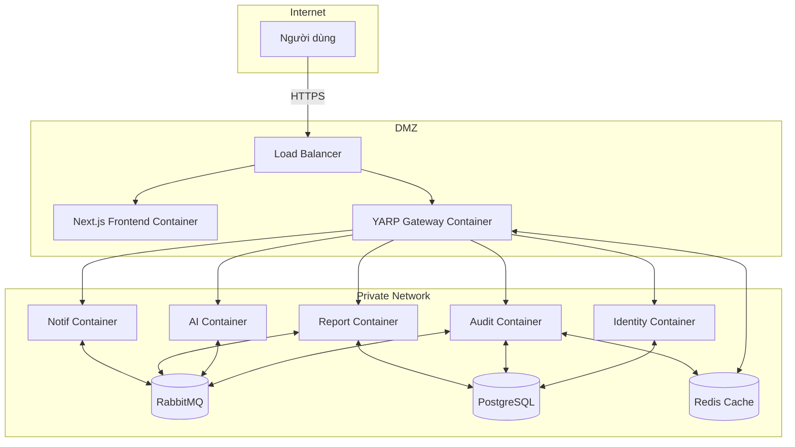

---

## 4. Yêu cầu chức năng chi tiết (Detailed Functional Requirements)

Trong phần này, các yêu cầu chức năng (Functional Requirements) sẽ được mô tả chi tiết dưới dạng Use Case.

### 4.1. Phân hệ Xác thực & Quản lý Người dùng (Identity Service)

**ID**: FR-101
- **Tên**: Đăng ký tài khoản bằng Email
- **Mô tả**: Cho phép người dùng mới tạo tài khoản trong hệ thống sử dụng địa chỉ email và mật khẩu.
- **Tác nhân**: Người dùng khách (Guest)
- **Điều kiện tiên quyết**: Người dùng chưa đăng nhập.
- **Luồng chính**:
  1. Người dùng truy cập trang Đăng ký.
  2. Người dùng nhập thông tin: Họ tên, Email, Mật khẩu, Xác nhận mật khẩu.
  3. Người dùng submit form.
  4. Hệ thống kiểm tra định dạng và tính hợp lệ của dữ liệu (validation).
  5. Hệ thống kiểm tra email đã tồn tại hay chưa.
  6. Hệ thống mã hóa mật khẩu (hashing bằng bcrypt/Argon2) và lưu thông tin người dùng vào database.
  7. Hệ thống tạo và gửi email xác thực tài khoản.
  8. Hiển thị thông báo đăng ký thành công và yêu cầu kiểm tra email.
- **Luồng thay thế**: N/A
- **Luồng ngoại lệ**:
  - Bước 4: Dữ liệu không hợp lệ (Email sai định dạng, mật khẩu yếu, họ tên quá ngắn/dài). Hệ thống hiển thị lỗi validation.
  - Bước 5: Email đã tồn tại. Hệ thống thông báo lỗi "Email đã được sử dụng".
- **Tiêu chí chấp nhận**:
  - Tên: Độ dài từ 2 đến 50 ký tự.
  - Email: Phải đúng định dạng chuẩn RFC 5322.
  - Mật khẩu: Tối thiểu 8 ký tự, phải bao gồm ít nhất 1 chữ hoa, 1 chữ thường, 1 số và 1 ký tự đặc biệt.
  - Tài khoản mới tạo có trạng thái "Unverified" cho đến khi click link xác thực.
- **Độ ưu tiên**: Must

**ID**: FR-102
- **Tên**: Đăng nhập bằng Email/Password
- **Mô tả**: Cho phép người dùng đăng nhập vào hệ thống bằng thông tin đã đăng ký.
- **Tác nhân**: Người dùng đã đăng ký (User)
- **Điều kiện tiên quyết**: Tài khoản đã được tạo và kích hoạt (verified).
- **Luồng chính**:
  1. Người dùng nhập Email và Mật khẩu trên trang Đăng nhập.
  2. Hệ thống xác thực thông tin đăng nhập với cơ sở dữ liệu.
  3. Hệ thống sinh ra Access Token (JWT) và Refresh Token.
  4. Lưu Refresh Token vào HTTP-only cookie và trả về Access Token qua response body.
  5. Chuyển hướng người dùng vào Dashboard.
- **Luồng thay thế**: N/A
- **Luồng ngoại lệ**:
  - Sai Email hoặc Mật khẩu: Hiển thị lỗi chung "Thông tin đăng nhập không chính xác".
  - Tài khoản chưa xác thực (unverified): Hiển thị yêu cầu xác thực email và có nút gửi lại email.
  - Tài khoản bị khóa (locked): Thông báo tài khoản đang bị khóa do vi phạm hoặc do nhập sai mật khẩu quá nhiều lần.
- **Tiêu chí chấp nhận**: 
  - Token JWT chứa các claim cơ bản: `sub` (User ID), `email`, `role`, `exp`.
  - Mật khẩu bị giới hạn rate limit: Khóa tài khoản 15 phút nếu nhập sai quá 5 lần.
- **Độ ưu tiên**: Must

**ID**: FR-103
- **Tên**: Đăng nhập bằng OAuth2 (Google, GitHub)
- **Mô tả**: Cho phép người dùng đăng nhập nhanh thông qua tài khoản Google hoặc GitHub.
- **Tác nhân**: Người dùng khách / Người dùng (Guest/User)
- **Điều kiện tiên quyết**: Có tài khoản Google hoặc GitHub.
- **Luồng chính**:
  1. Người dùng chọn "Đăng nhập bằng Google/GitHub".
  2. Chuyển hướng tới trang xác thực của Provider (Google/GitHub).
  3. Người dùng đồng ý cấp quyền.
  4. Provider trả về Auth Code cho hệ thống (Callback URL).
  5. Hệ thống trao đổi Auth Code lấy User Profile từ Provider.
  6. Kiểm tra User trong DB (dựa trên Provider ID và Email). Nếu chưa có thì tự động tạo tài khoản mới.
  7. Sinh Access Token và Refresh Token, cấp quyền truy cập.
- **Luồng thay thế**: N/A
- **Luồng ngoại lệ**:
  - Người dùng từ chối cấp quyền trên trang Provider: Trở về trang đăng nhập với thông báo hủy.
  - Lỗi kết nối API của Provider: Thông báo "Dịch vụ đăng nhập bên thứ 3 đang gián đoạn".
- **Tiêu chí chấp nhận**: 
  - Hệ thống tự động map các trường Avatar, Tên, Email từ Provider.
- **Độ ưu tiên**: Should

**ID**: FR-104
- **Tên**: Làm mới Access Token (Refresh Token flow)
- **Mô tả**: Tự động cấp lại Access Token mới khi token cũ hết hạn mà không cần đăng nhập lại.
- **Tác nhân**: Ứng dụng client (Web/Extension)
- **Điều kiện tiên quyết**: Refresh Token hợp lệ còn lưu trong Cookie hoặc Storage.
- **Luồng chính**:
  1. Access Token hết hạn, Client gửi request `/refresh-token` kèm theo Refresh Token.
  2. Hệ thống kiểm tra tính hợp lệ của Refresh Token trong DB (chưa bị revoke, chưa hết hạn).
  3. Hệ thống tạo Access Token mới và Refresh Token mới (Rotated).
  4. Trả token mới cho Client.
- **Luồng ngoại lệ**:
  - Refresh Token không hợp lệ hoặc đã bị revoke: Xóa Cookie, trả về HTTP 401, yêu cầu Client chuyển hướng về trang Đăng nhập.
- **Tiêu chí chấp nhận**: 
  - Triển khai cơ chế Refresh Token Rotation để bảo mật. Revoke toàn bộ token tree nếu phát hiện token cũ được sử dụng lại (Reuse Detection).
- **Độ ưu tiên**: Must

**ID**: FR-105
- **Tên**: Đăng xuất
- **Mô tả**: Hủy phiên đăng nhập hiện tại của người dùng.
- **Tác nhân**: Người dùng (User)
- **Điều kiện tiên quyết**: Đang đăng nhập.
- **Luồng chính**:
  1. Người dùng nhấn nút Đăng xuất.
  2. Client gọi API đăng xuất, gửi Refresh Token hiện tại.
  3. Hệ thống đánh dấu (Revoke) Refresh Token trong DB.
  4. Client xóa Access Token (Local/Session Storage) và Cookie chứa Refresh Token.
  5. Chuyển hướng về trang chủ/đăng nhập.
- **Luồng ngoại lệ**: N/A
- **Tiêu chí chấp nhận**: 
  - Token đã revoke không thể dùng để làm mới token nữa.
- **Độ ưu tiên**: Must

**ID**: FR-106
- **Tên**: Quản lý thông tin cá nhân
- **Mô tả**: Người dùng có thể cập nhật thông tin profile như Họ tên, Ảnh đại diện, Công ty.
- **Tác nhân**: Người dùng (User)
- **Điều kiện tiên quyết**: Đang đăng nhập.
- **Luồng chính**:
  1. Truy cập trang Profile.
  2. Thay đổi thông tin (Họ tên, Bio, Avatar).
  3. Submit thay đổi.
  4. Hệ thống validate và lưu xuống CSDL.
  5. Cập nhật giao diện.
- **Luồng ngoại lệ**:
  - Ảnh vượt quá kích thước cho phép (VD: > 2MB) hoặc sai định dạng: Báo lỗi.
- **Tiêu chí chấp nhận**: Upload file ảnh lưu trữ lên Cloud/S3.
- **Độ ưu tiên**: Should

**ID**: FR-107
- **Tên**: Đổi mật khẩu
- **Mô tả**: Thay đổi mật khẩu khi vẫn nhớ mật khẩu cũ và đang đăng nhập.
- **Tác nhân**: Người dùng (User)
- **Điều kiện tiên quyết**: Đang đăng nhập, đăng nhập bằng tài khoản Email/Pass (không áp dụng cho OAuth only).
- **Luồng chính**:
  1. Người dùng vào Cài đặt -> Đổi mật khẩu.
  2. Nhập Mật khẩu hiện tại, Mật khẩu mới, Xác nhận mật khẩu mới.
  3. Hệ thống kiểm tra Mật khẩu hiện tại. Nếu đúng, hash mật khẩu mới và lưu DB.
  4. Hệ thống vô hiệu hóa (revoke) tất cả các phiên đăng nhập khác của user.
- **Luồng ngoại lệ**:
  - Mật khẩu hiện tại sai: Hiển thị lỗi.
- **Tiêu chí chấp nhận**: Giống rule validate ở FR-101.
- **Độ ưu tiên**: Must

**ID**: FR-108
- **Tên**: Quên mật khẩu / Reset Password qua Email
- **Mô tả**: Cấp lại mật khẩu mới khi người dùng quên mật khẩu.
- **Tác nhân**: Người dùng khách (Guest)
- **Điều kiện tiên quyết**: N/A
- **Luồng chính**:
  1. Nhấn "Quên mật khẩu", nhập Email.
  2. Hệ thống kiểm tra email tồn tại.
  3. Tạo Reset Token (có thời hạn 15-30p) và gửi kèm link reset qua email.
  4. User click link, nhập mật khẩu mới và xác nhận.
  5. Hệ thống đổi mật khẩu thành công.
- **Luồng ngoại lệ**:
  - Link/Token hết hạn: Thông báo hết hạn, yêu cầu gửi lại.
- **Tiêu chí chấp nhận**: Không thông báo ra ngoài nếu email không tồn tại trong hệ thống (để chống dò quét), chỉ hiển thị thông báo chung "Nếu email tồn tại, link reset đã được gửi".
- **Độ ưu tiên**: Must

---

### 4.2. Phân hệ Tiện ích mở rộng (Chrome Extension)

**ID**: FR-201
- **Tên**: Đăng nhập trên Chrome Extension
- **Mô tả**: Xác thực người dùng trên Extension để sử dụng tính năng trả phí/lưu lịch sử.
- **Tác nhân**: Người dùng (User)
- **Luồng chính**:
  1. Mở Extension.
  2. Click "Đăng nhập". Extension mở tab web dashboard.
  3. User đăng nhập trên Web.
  4. Web dashboard truyền JWT (Access Token) sang Extension thông qua Chrome `runtime.sendMessage` hoặc sync storage.
  5. Extension xác nhận đăng nhập thành công.
- **Luồng thay thế**: Người dùng nhập trực tiếp email/pass trên popup Extension.
- **Tiêu chí chấp nhận**: Sync trạng thái auth mượt mà giữa Web và Extension.
- **Độ ưu tiên**: Must

**ID**: FR-202
- **Tên**: Kích hoạt phân tích trang hiện tại
- **Mô tả**: Bấm nút để Audit trang web đang mở ở tab hiện tại.
- **Tác nhân**: Người dùng (User)
- **Luồng chính**:
  1. User đang ở trang `example.com/page`.
  2. Mở Extension popup, nhấn "Analyze Current Page".
  3. Extension trích xuất URL và HTML hiện tại.
  4. Extension gọi API của hệ thống (Audit Service) truyền lên URL.
  5. Hệ thống trả về trạng thái "Processing", Extension hiển thị loading spinner.
- **Tiêu chí chấp nhận**: Xử lý được cả các trang SPA (Single Page Applications) bằng cách chèn script vào DOM nếu cần.
- **Độ ưu tiên**: Must

**ID**: FR-203
- **Tên**: Hiển thị kết quả phân tích nhanh
- **Mô tả**: Hiện tổng quan điểm số SEO, Performance ngay trong popup của Extension.
- **Tác nhân**: Người dùng (User)
- **Luồng chính**:
  1. Sau khi phân tích xong, API trả về JSON.
  2. Extension parse và hiển thị điểm số (0-100) cho SEO, Performance (Mobile/Desktop).
  3. Hiển thị danh sách top 3 các lỗi (Errors) nghiêm trọng nhất.
- **Tiêu chí chấp nhận**: UI nhỏ gọn, render nhanh < 500ms sau khi có data.
- **Độ ưu tiên**: Must

**ID**: FR-204
- **Tên**: Nhận thông báo real-time khi phân tích hoàn tất
- **Mô tả**: Extension nhận WebSocket event khi background worker trên server phân tích xong (do quá trình quét có thể mất vài chục giây).
- **Tiêu chí chấp nhận**: Sử dụng SignalR / Socket.io để Extension lắng nghe event `AuditCompleted` của URL tương ứng.
- **Độ ưu tiên**: Should

**ID**: FR-205
- **Tên**: Xem lịch sử phân tích gần đây
- **Mô tả**: Extension hiển thị danh sách 5-10 URLs gần nhất đã được phân tích.
- **Độ ưu tiên**: Could

**ID**: FR-206
- **Tên**: Quick actions
- **Mô tả**: Cung cấp các nút bấm nhanh: "Mở Dashboard chi tiết", "Download PDF", "Re-analyze".
- **Độ ưu tiên**: Must

---

### 4.3. Phân hệ Thu thập & Đánh giá (Audit Service)

**ID**: FR-301
- **Tên**: Tiếp nhận và xác thực URL
- **Mô tả**: Kiểm tra tính hợp lệ của URL được submit trước khi đưa vào hàng đợi.
- **Tiêu chí chấp nhận**: Phải là URL public hợp lệ (HTTP/HTTPS). Chặn các IP local/private (chống SSRF).
- **Độ ưu tiên**: Must

**ID**: FR-302
- **Tên**: Quản lý hàng đợi phân tích
- **Mô tả**: Đưa job vào RabbitMQ để xử lý bất đồng bộ.
- **Luồng chính**:
  1. API nhận URL, lưu record vào Postgres với trạng thái `Pending`.
  2. Gửi Message (AuditCommand) vào RabbitMQ.
  3. Trả về Audit ID cho client.
  4. Worker (MassTransit) consume message, chuyển trạng thái thành `Processing`.
  5. Hoàn thành thì đổi thành `Completed`, lỗi thì `Failed`.
- **Tiêu chí chấp nhận**: Timeout cho một job tối đa 3 phút.
- **Độ ưu tiên**: Must

**ID**: FR-303
- **Tên**: Tích hợp Google PageSpeed Insights API
- **Mô tả**: Gọi Google API để lấy chỉ số Core Web Vitals.
- **Tiêu chí chấp nhận**: Phải lấy đủ: LCP (Largest Contentful Paint), INP (Interaction to Next Paint), CLS (Cumulative Layout Shift), TTFB, FCP, SI. Áp dụng cho cả 2 chiến lược `mobile` và `desktop`. Lưu raw JSON vào blob/redis và parsed data vào DB.
- **Độ ưu tiên**: Must

**ID**: FR-304
- **Tên**: Trích xuất và phân tích HTML/SEO on-page
- **Mô tả**: Thu thập mã nguồn HTML để phân tích cấu trúc SEO.
- **Tiêu chí chấp nhận**: Phân tích: Meta Title, Description (độ dài, ký tự), Headings (H1 duy nhất, H2-H6 hợp lý), thuộc tính `alt` của tất cả ``, thẻ Canonical hợp lệ, khai báo Open Graph/Twitter Card, phát hiện Schema Markup (JSON-LD), kiểm tra link sitemap trong `robots.txt`.
- **Độ ưu tiên**: Must

**ID**: FR-305
- **Tên**: Kiểm tra trạng thái SSL/HTTPS
- **Mô tả**: Kiểm tra chứng chỉ SSL của website, ngày hết hạn và độ hợp lệ.
- **Độ ưu tiên**: Should

**ID**: FR-306
- **Tên**: Phân tích tốc độ tải tài nguyên
- **Mô tả**: Phân tích dung lượng DOM, số lượng JS/CSS files chặn hiển thị (render-blocking).
- **Độ ưu tiên**: Should

---

### 4.4. Phân hệ Phân tích AI (AI Service)

**ID**: FR-401
- **Tên**: Tổng hợp dữ liệu thô thành prompt có cấu trúc
- **Mô tả**: Dịch vụ AI thu thập kết quả từ Audit Service để tạo prompt system chuyên gia SEO.
- **Tiêu chí chấp nhận**: Prompt phải rõ ràng, cung cấp dữ liệu số (LCP là bao nhiêu, title thiếu gì) và yêu cầu AI đóng vai chuyên gia SEO đưa ra kế hoạch hành động.
- **Độ ưu tiên**: Must

**ID**: FR-402
- **Tên**: Gửi yêu cầu phân tích đến Gemini API
- **Mô tả**: Gọi Google Gemini AI API để sinh nhận xét và giải pháp.
- **Tiêu chí chấp nhận**: Sử dụng model phù hợp (Gemini 1.5 Pro/Flash). Thời gian chờ API không quá 30 giây.
- **Độ ưu tiên**: Must

**ID**: FR-403
- **Tên**: Xử lý và định dạng phản hồi từ AI
- **Mô tả**: Parse kết quả trả về, đặc biệt hỗ trợ định dạng Markdown và Code blocks.
- **Tiêu chí chấp nhận**: Kết quả từ AI (thường là markdown) phải được lưu trữ nguyên bản để UI tự render (React Markdown) nhưng phải loại bỏ các ký tự lạ hoặc thẻ script độc hại (sanitization).
- **Độ ưu tiên**: Must

**ID**: FR-404
- **Tên**: Lưu trữ lịch sử prompt và response
- **Mô tả**: Lưu lại log giao tiếp với AI API phục vụ audit chi phí và debug.
- **Tiêu chí chấp nhận**: Tính toán số lượng Token In/Out cho mỗi request và lưu vào DB.
- **Độ ưu tiên**: Should

**ID**: FR-405
- **Tên**: Cơ chế Retry và Fallback
- **Mô tả**: Đảm bảo hệ thống không crash khi AI API bị lỗi/rate limit.
- **Tiêu chí chấp nhận**: Sử dụng Polly (trong .NET) để Retry 3 lần với Exponential Backoff. Nếu thất bại sau 3 lần, trả về trạng thái báo cáo là "Audit thành công, nhưng tính năng AI Advice tạm thời không khả dụng".
- **Độ ưu tiên**: Must

---

### 4.5. Phân hệ Báo cáo (Report Service)

**ID**: FR-501
- **Tên**: Tạo và lưu trữ báo cáo tổng hợp
- **Mô tả**: Tổng hợp điểm số, data từ Audit, lời khuyên từ AI thành một Report Object hoàn chỉnh.
- **Tiêu chí chấp nhận**: Lưu trữ JSON phức tạp vào PostgreSQL (JSONB format) hoặc NoSQL.
- **Độ ưu tiên**: Must

**ID**: FR-502
- **Tên**: Dashboard tổng quan
- **Mô tả**: Hiển thị danh sách các website (Projects) mà người dùng đang theo dõi, với điểm số Audit mới nhất.
- **Luồng chính**:
  1. User truy cập Dashboard.
  2. Hệ thống query bảng Projects của user.
  3. Lấy ra report mới nhất của mỗi project để hiển thị số liệu tóm tắt (Avg Score, LCP, Issues count).
- **Độ ưu tiên**: Must

**ID**: FR-503
- **Tên**: Biểu đồ lịch sử Core Web Vitals
- **Mô tả**: Vẽ biểu đồ dạng Line chart (bằng Chart.js hoặc Recharts) sự thay đổi của LCP, CLS qua các ngày audit.
- **Tiêu chí chấp nhận**: Có thể filter dữ liệu theo tuần, tháng.
- **Độ ưu tiên**: Should

**ID**: FR-504
- **Tên**: So sánh hiệu suất giữa các lần audit
- **Mô tả**: Cho phép chọn 2 mốc thời gian của cùng 1 URL để hiển thị diff (màu xanh/đỏ cho cải thiện/kém đi).
- **Độ ưu tiên**: Could

**ID**: FR-505
- **Tên**: Xuất báo cáo PDF
- **Mô tả**: Chuyển đổi báo cáo chi tiết trên web thành file PDF có format đẹp để khách hàng gửi cho đối tác/sếp.
- **Tiêu chí chấp nhận**: Hỗ trợ font tiếng Việt. Có thể dùng Puppeteer/wkhtmltopdf.
- **Độ ưu tiên**: Should

**ID**: FR-506
- **Tên**: Quản lý Projects và Websites
- **Mô tả**: Các tính năng CRUD cho việc thêm, sửa, xóa các URL muốn theo dõi định kỳ.
- **Độ ưu tiên**: Must

---

### 4.6. Phân hệ Thông báo & Cảnh báo (Notification Service)

**ID**: FR-601
- **Tên**: Gửi thông báo real-time qua WebSocket
- **Mô tả**: Đẩy thông báo "Báo cáo của bạn đã sẵn sàng" về UI (Web/Extension) khi xử lý xong job.
- **Tiêu chí chấp nhận**: Dùng thư viện SignalR ở backend và client.
- **Độ ưu tiên**: Must

**ID**: FR-602
- **Tên**: Uptime Monitoring
- **Mô tả**: Chạy background job (Cron/Hangfire) để ping vào các URL được cấu hình mỗi 5-15 phút.
- **Tiêu chí chấp nhận**: Ghi nhận thời gian phản hồi (ms) và HTTP Status Code.
- **Độ ưu tiên**: Should

**ID**: FR-603
- **Tên**: Gửi email cảnh báo khi website down
- **Mô tả**: Nếu Uptime monitoring ping thất bại (HTTP >= 500 hoặc timeout), tự động gửi Email khẩn cấp cho chủ tài khoản.
- **Tiêu chí chấp nhận**: Hạn chế spam: chỉ gửi 1 email lúc bắt đầu down, và 1 email khi hệ thống up trở lại (Recovery).
- **Độ ưu tiên**: Should

**ID**: FR-604
- **Tên**: Cấu hình ngưỡng cảnh báo
- **Mô tả**: Cho phép người dùng thiết lập: "Báo cho tôi nếu điểm Performance tụt xuống dưới 50" hoặc "Báo cho tôi nếu LCP > 3s".
- **Độ ưu tiên**: Could

**ID**: FR-605
- **Tên**: Lịch sử thông báo đã gửi
- **Mô tả**: Giao diện In-app notification center (quả chuông góc phải màn hình) hiển thị danh sách các thông báo.
- **Độ ưu tiên**: Must

---

### 4.7. Phân hệ Quản trị hệ thống (Admin)

**ID**: FR-701
- **Tên**: Dashboard quản trị
- **Mô tả**: Màn hình dành riêng cho tài khoản có Role = Admin, cung cấp cái nhìn tổng thể về SaaS.
- **Tiêu chí chấp nhận**: Hiển thị: Tổng số Users, MAU (Monthly Active Users), Tổng số Audits đã chạy, Số credits AI đã tiêu thụ.
- **Độ ưu tiên**: Must

**ID**: FR-702
- **Tên**: Quản lý người dùng
- **Mô tả**: Danh sách người dùng, chức năng View details, Lock/Unlock tài khoản (Block), Delete.
- **Độ ưu tiên**: Must

**ID**: FR-703
- **Tên**: Giám sát hệ thống
- **Mô tả**: Theo dõi tình trạng các Microservices.
- **Tiêu chí chấp nhận**: View được RabbitMQ queue depth (số lượng job đang chờ), tỷ lệ lỗi của AI Service, trạng thái kết nối DB/Redis (thông qua Health Checks API).
- **Độ ưu tiên**: Should

**ID**: FR-704
- **Tên**: Quản lý cấu hình hệ thống
- **Mô tả**: Admin có thể thay đổi Rate limits (ví dụ: cấp cho User Free 5 audits/ngày), cập nhật API Keys (Gemini, PageSpeed) mà không cần deploy lại code.
- **Tiêu chí chấp nhận**: Dữ liệu cấu hình lưu trong CSDL hoặc Redis, áp dụng thay đổi realtime.
- **Độ ưu tiên**: Must

---


### 4.8. Phân hệ Gói dịch vụ & Thanh toán (Subscription & Billing Service)

### FR-801: Xem danh sách gói dịch vụ (Pricing Plans)
- **ID**: FR-801
- **Tên**: Xem danh sách gói dịch vụ
- **Mô tả**: Cho phép người dùng (cả Guest và User) xem thông tin chi tiết về các gói dịch vụ (Free, Pro, Enterprise) và so sánh tính năng.
- **Tác nhân**: Guest, User, Admin
- **Điều kiện tiên quyết**: Không có.
- **Luồng chính**:
  1. Người dùng truy cập vào trang "Bảng giá" (Pricing) trên website.
  2. Hệ thống gọi API lấy danh sách các gói dịch vụ đang ở trạng thái active từ database.
  3. Hệ thống hiển thị 3 gói dịch vụ mặc định: Free, Pro, Enterprise.
  4. Đối với mỗi gói, hiển thị tên gói, giá tiền (theo tháng/năm), và hạn mức (số lượt audit/tháng, số thành viên, quyền truy cập API, lập lịch tự động).
  5. Người dùng cuộn xuống để xem bảng so sánh tính năng chi tiết giữa các gói (Comparison Table).
  6. Người dùng có thể click toggle để chuyển đổi giữa chu kỳ thanh toán "Hàng tháng" và "Hàng năm".
  7. Hệ thống tự động cập nhật lại giá tiền và hiển thị mức giảm giá (nếu có) khi chọn thanh toán hàng năm.
  8. Người dùng nhấn nút "Đăng ký" (hoặc "Nâng cấp") tại gói mong muốn.
- **Luồng thay thế**: 
  - (Bước 2a) Nếu hệ thống không thể kết nối tới cơ sở dữ liệu, hiển thị thông báo lỗi thân thiện "Không thể tải danh sách bảng giá lúc này. Vui lòng thử lại sau" và nút Retry.
- **Luồng ngoại lệ**:
  - Không có gói dịch vụ nào được định nghĩa trong hệ thống -> Hiển thị gói Free mặc định và thông báo bảo trì.
- **Tiêu chí chấp nhận**:
  - Bảng giá phải hiển thị chính xác giá trị và hạn mức của từng gói.
  - Hiệu ứng chuyển đổi tháng/năm phải mượt mà và tính toán giá chính xác.
  - Giao diện đáp ứng (responsive) trên các thiết bị di động.
- **Độ ưu tiên**: Must

### FR-802: Đăng ký gói dịch vụ (Subscribe to Plan)
- **ID**: FR-802
- **Tên**: Đăng ký gói dịch vụ
- **Mô tả**: Cho phép người dùng thanh toán để nâng cấp lên các gói dịch vụ trả phí (Pro, Enterprise).
- **Tác nhân**: User
- **Điều kiện tiên quyết**: Người dùng đã đăng nhập vào hệ thống và đang ở gói thấp hơn gói muốn đăng ký.
- **Luồng chính**:
  1. Người dùng chọn gói dịch vụ (Pro/Enterprise) và chu kỳ thanh toán.
  2. Hệ thống kiểm tra trạng thái tài khoản và xác nhận gói hiện tại.
  3. Hệ thống chuyển hướng người dùng đến trang Checkout (Thanh toán).
  4. Người dùng nhập thông tin thanh toán (Thẻ tín dụng) hoặc chọn cổng thanh toán (Stripe/MoMo/VNPay).
  5. Hệ thống gửi yêu cầu tạo phiên thanh toán (Checkout Session) tới Cổng thanh toán.
  6. Người dùng thực hiện xác thực 3D Secure (nếu được yêu cầu bởi ngân hàng).
  7. Cổng thanh toán trả về kết quả thành công.
  8. Hệ thống cập nhật trạng thái Subscription của người dùng, nâng cấp hạn mức (Quota) tương ứng.
  9. Hệ thống gửi email xác nhận thanh toán và đính kèm hóa đơn.
  10. Chuyển hướng người dùng về trang Dashboard với thông báo "Nâng cấp thành công".
- **Luồng thay thế**:
  - (Bước 7a) Thanh toán thất bại (thẻ từ chối, không đủ số dư): Hệ thống hiển thị lỗi từ cổng thanh toán và yêu cầu người dùng thử lại thẻ khác.
- **Luồng ngoại lệ**:
  - (Bước 5a) Cổng thanh toán bị lỗi kết nối: Ghi log lỗi, báo cho người dùng hệ thống thanh toán đang bảo trì.
- **Tiêu chí chấp nhận**:
  - Thông tin thẻ không được lưu trữ trên server (PCI-DSS compliance).
  - Quota phải được cập nhật ngay lập tức sau khi thanh toán thành công (độ trễ < 2s).
- **Độ ưu tiên**: Must

### FR-803: Quản lý gói dịch vụ hiện tại
- **ID**: FR-803
- **Tên**: Quản lý gói dịch vụ hiện tại
- **Mô tả**: Xem thông tin gói, thống kê sử dụng, thực hiện nâng cấp/hạ cấp hoặc hủy gia hạn.
- **Tác nhân**: User (Owner của Workspace)
- **Điều kiện tiên quyết**: Đã đăng nhập.
- **Luồng chính**:
  1. Người dùng truy cập trang "Billing & Plan" trong phần cài đặt.
  2. Hệ thống hiển thị gói dịch vụ hiện tại, ngày hết hạn/gia hạn tiếp theo.
  3. Hệ thống hiển thị thanh tiến trình (progress bar) thể hiện mức độ sử dụng Quota (Số lượt Audit, số lượng thành viên, API calls).
  4. Người dùng chọn "Upgrade Plan" để nâng cấp hoặc "Downgrade Plan" để hạ cấp.
  5. Nếu nâng cấp, hệ thống tính toán số tiền chênh lệch (proration) và yêu cầu thanh toán khoản bù.
  6. Nếu hủy gia hạn (Cancel Subscription), hệ thống hiển thị form xác nhận lý do hủy.
  7. Người dùng xác nhận hủy.
  8. Hệ thống đánh dấu trạng thái "Canceled at period end". Người dùng vẫn được dùng tính năng Pro đến hết chu kỳ đã thanh toán.
- **Luồng thay thế**: Không có
- **Luồng ngoại lệ**:
  - Tính toán proration gặp lỗi do thay đổi timezone -> rollback giao dịch và báo lỗi.
- **Tiêu chí chấp nhận**:
  - Tính proration phải chính xác đến từng ngày.
  - Hủy gia hạn không được làm mất quyền lợi lập tức.
- **Độ ưu tiên**: Must

### FR-804: Lịch sử thanh toán & Hóa đơn
- **ID**: FR-804
- **Tên**: Lịch sử thanh toán & Hóa đơn
- **Mô tả**: Người dùng có thể xem lịch sử các lần giao dịch và tải về hóa đơn PDF.
- **Tác nhân**: User
- **Điều kiện tiên quyết**: Đã có ít nhất 1 giao dịch trong quá khứ.
- **Luồng chính**:
  1. Người dùng vào tab "Payment History".
  2. Hệ thống truy xuất danh sách giao dịch từ cơ sở dữ liệu.
  3. Hiển thị bảng bao gồm: Mã giao dịch, Ngày, Số tiền, Gói dịch vụ, Trạng thái (Paid/Pending/Failed/Refunded).
  4. Người dùng có thể click vào icon "Download" trên từng dòng.
  5. Hệ thống gọi dịch vụ sinh PDF (Invoice Generator).
  6. File PDF hóa đơn được tạo chứa thông tin công ty, thông tin người dùng, chi tiết thuế (VAT).
  7. Trình duyệt bắt đầu tải xuống file hóa đơn (.pdf).
- **Luồng thay thế**: 
  - (Bước 3a) Có thể filter theo trạng thái hoặc khoảng thời gian.
- **Luồng ngoại lệ**:
  - Dịch vụ sinh PDF bị quá tải -> Trả về thông báo thử lại.
- **Tiêu chí chấp nhận**:
  - Hóa đơn phải đạt chuẩn định dạng (chứa mã số thuế, địa chỉ).
- **Độ ưu tiên**: Should

### FR-805: Quản lý Usage Quota
- **ID**: FR-805
- **Tên**: Quản lý Usage Quota
- **Mô tả**: Theo dõi và kiểm soát tài nguyên hệ thống mà người dùng tiêu thụ.
- **Tác nhân**: System
- **Điều kiện tiên quyết**: Không
- **Luồng chính**:
  1. Mỗi khi người dùng thực hiện một hành động (VD: chạy Audit, gọi API, phân tích AI).
  2. Hệ thống chặn request và kiểm tra Quota hiện tại trong Redis/Database.
  3. Nếu Quota còn trống, hệ thống cho phép hành động tiếp tục và trừ đi 1 đơn vị Quota.
  4. Nếu Quota đạt ngưỡng 80%, hệ thống tự động gửi email cảnh báo "Bạn đã sử dụng 80% hạn mức tháng này".
  5. Nếu Quota đạt 100%, hệ thống block request và trả về lỗi `402 Payment Required` hoặc `429 Too Many Requests`.
  6. Giao diện hiển thị popup yêu cầu nâng cấp gói hoặc mua thêm Add-on.
  7. Vào ngày đầu tiên của chu kỳ thanh toán mới, hệ thống reset Quota về mức mặc định của gói.
- **Luồng thay thế**:
  - (Bước 5a) Với gói Enterprise có overage billing, hệ thống vẫn cho phép vượt hạn mức nhưng ghi nhận số lượng vượt để tính phí vào cuối tháng.
- **Luồng ngoại lệ**: Không có.
- **Tiêu chí chấp nhận**:
  - Quota phải được đếm chính xác, hỗ trợ high-concurrency (tránh race condition).
- **Độ ưu tiên**: Must

### FR-806: Mã giảm giá & Khuyến mãi (Coupon/Promo)
- **ID**: FR-806
- **Tên**: Áp dụng mã giảm giá
- **Mô tả**: Người dùng có thể nhập mã giảm giá khi thanh toán để được trừ tiền.
- **Tác nhân**: User, Admin
- **Điều kiện tiên quyết**: Admin đã tạo mã coupon trong hệ thống.
- **Luồng chính**:
  1. Tại trang Checkout, người dùng nhập mã coupon vào ô "Promo Code".
  2. Người dùng nhấn "Apply".
  3. Hệ thống kiểm tra tính hợp lệ của mã (tồn tại, chưa hết hạn, số lượt sử dụng chưa vượt quá mức cho phép, áp dụng đúng cho gói dịch vụ đã chọn).
  4. Nếu hợp lệ, hệ thống tính toán lại tổng tiền dựa trên loại giảm giá (phần trăm % hoặc số tiền cố định).
  5. Giao diện cập nhật lại số tiền Total và hiển thị số tiền được giảm.
  6. Khi thanh toán thành công, hệ thống ghi nhận mã giảm giá đã được sử dụng (tăng biến đếm used_count).
- **Luồng thay thế**:
  - (Bước 3a) Mã không hợp lệ (hết hạn, sai mã): Hiển thị thông báo lỗi màu đỏ ngay dưới ô nhập liệu.
- **Luồng ngoại lệ**: Không có.
- **Tiêu chí chấp nhận**:
  - Một hóa đơn chỉ áp dụng được tối đa 1 mã giảm giá (trừ khi có quy định khác).
- **Độ ưu tiên**: Should

### FR-807: Webhook thanh toán (Payment Webhook)
- **ID**: FR-807
- **Tên**: Webhook thanh toán
- **Mô tả**: Hệ thống nhận các sự kiện bất đồng bộ từ cổng thanh toán (VD: Stripe Webhook).
- **Tác nhân**: Payment Gateway (Stripe/MoMo)
- **Điều kiện tiên quyết**: Hệ thống đã đăng ký endpoint Webhook với đối tác thanh toán.
- **Luồng chính**:
  1. Cổng thanh toán gửi một HTTP POST request đến endpoint `/api/v1/webhooks/payment`.
  2. Hệ thống tính toán chữ ký HMAC (Signature) dựa trên secret key để xác thực payload.
  3. Hệ thống parse payload để lấy loại sự kiện (Event Type).
  4. Nếu sự kiện là `invoice.payment_succeeded`, hệ thống gia hạn gói dịch vụ cho user và cộng Quota.
  5. Nếu sự kiện là `invoice.payment_failed`, hệ thống gửi email nhắc nhở thanh toán, đánh dấu tài khoản là Past Due.
  6. Nếu sự kiện là `customer.subscription.deleted`, hệ thống hạ cấp người dùng về gói Free.
  7. Hệ thống lưu log sự kiện vào database.
  8. Hệ thống phản hồi `200 OK` về cho cổng thanh toán.
- **Luồng thay thế**: Không có.
- **Luồng ngoại lệ**:
  - (Bước 2a) Chữ ký không khớp -> Trả về `401 Unauthorized` và chặn request để chống giả mạo.
  - (Bước 8a) Xử lý nội bộ bị lỗi -> Trả về `500`. Cổng thanh toán sẽ retry gửi lại webhook sau. (Yêu cầu tính Idempotent - không xử lý trùng lặp).
- **Tiêu chí chấp nhận**:
  - Endpoint Webhook phải xử lý idempotent (xử lý an toàn khi 1 event bị gửi nhiều lần).
- **Độ ưu tiên**: Must

---

### 4.9. Phân hệ Nhóm & Tổ chức (Team & Organization Service)

### FR-901: Tạo tổ chức (Create Organization)
- **ID**: FR-901
- **Tên**: Tạo tổ chức
- **Mô tả**: Người dùng có thể tạo một môi trường không gian làm việc (workspace/organization) riêng để mời nhóm vào làm việc.
- **Tác nhân**: User
- **Điều kiện tiên quyết**: Đăng nhập thành công và gói dịch vụ cho phép tạo Organization.
- **Luồng chính**:
  1. Người dùng nhấn nút "Create Organization".
  2. Hệ thống hiển thị form yêu cầu nhập Tên tổ chức, Domain công ty, và tải lên Logo.
  3. Người dùng điền thông tin hợp lệ và nhấn Submit.
  4. Hệ thống tạo bản ghi Organization trong database.
  5. Hệ thống gán quyền "Owner" cho người tạo đối với Organization này.
  6. Hệ thống tạo một Dashboard riêng biệt (context) cho Tổ chức.
  7. Chuyển hướng người dùng vào giao diện Tổ chức vừa tạo.
- **Luồng thay thế**: Không có.
- **Luồng ngoại lệ**:
  - Tên tổ chức bị trùng (nếu yêu cầu unique slug) -> Báo lỗi yêu cầu đổi tên khác.
- **Tiêu chí chấp nhận**:
  - Quá trình chuyển đổi context giữa Personal Workspace và Organization Workspace phải rõ ràng trên UI.
- **Độ ưu tiên**: Must

### FR-902: Quản lý thành viên (Member Management)
- **ID**: FR-902
- **Tên**: Quản lý thành viên
- **Mô tả**: Mời, xóa, và thay đổi vai trò của các thành viên trong tổ chức.
- **Tác nhân**: Admin, Owner
- **Điều kiện tiên quyết**: Tổ chức đã được tạo.
- **Luồng chính**:
  1. Chủ sở hữu truy cập "Team Settings" > "Members".
  2. Nhấn "Invite Member".
  3. Nhập danh sách địa chỉ email và chọn Vai trò (Admin, Editor, Viewer).
  4. Hệ thống kiểm tra giới hạn số lượng thành viên của gói dịch vụ hiện tại.
  5. Hệ thống gửi email mời tham gia có chứa link token (hiệu lực 48h).
  6. Thành viên được mời click vào link email, tạo tài khoản (nếu chưa có) hoặc đăng nhập.
  7. Thành viên chấp nhận lời mời (Accept).
  8. Hệ thống thêm user vào organization với role đã định.
- **Luồng thay thế**:
  - (Bước 8a) Owner có thể thay đổi role của member hiện tại hoặc Remove member.
  - (Bước 8b) Owner có thể Transfer Ownership cho một Admin khác.
- **Luồng ngoại lệ**:
  - (Bước 4a) Vượt quá giới hạn thành viên -> Chặn hành động và gợi ý nâng cấp gói (Upgrade).
- **Tiêu chí chấp nhận**:
  - Token mời phải được mã hóa và có thời hạn.
- **Độ ưu tiên**: Must

### FR-903: Phân quyền theo tổ chức (Organization-level RBAC)
- **ID**: FR-903
- **Tên**: Phân quyền theo tổ chức (RBAC)
- **Mô tả**: Kiểm soát quyền truy cập tài nguyên dựa trên vai trò của người dùng trong tổ chức.
- **Tác nhân**: System
- **Điều kiện tiên quyết**: Đã có thành viên trong tổ chức.
- **Luồng chính**:
  1. Khi User thực hiện API request (VD: tạo project, xóa báo cáo).
  2. Gateway/Middleware giải mã JWT token để lấy UserID.
  3. Hệ thống kiểm tra vai trò của User trong Organization tương ứng (Role).
  4. Hệ thống đối chiếu với bảng quyền (Permissions Policy):
     - Owner: Full quyền quản trị, thanh toán, xóa tổ chức.
     - Admin: Quản lý thành viên, mọi project.
     - Editor: Tạo/Sửa project, chạy Audit.
     - Viewer: Chỉ được xem báo cáo (Read-only).
  5. Nếu Role có đủ quyền, cho phép request đi tiếp tới Controller.
  6. Nếu không đủ quyền, trả về lỗi `403 Forbidden`.
  7. Giao diện tự động ẩn đi các nút (button) hành động nếu user không có quyền tương ứng.
- **Luồng thay thế**: Không có.
- **Luồng ngoại lệ**: Không có.
- **Tiêu chí chấp nhận**:
  - Phân quyền phải hoạt động ở cấp độ API backend (không chỉ ẩn UI).
- **Độ ưu tiên**: Must

### FR-904: Quản lý dự án nhóm (Team Projects)
- **ID**: FR-904
- **Tên**: Quản lý dự án nhóm
- **Mô tả**: Khởi tạo và chia sẻ không gian làm việc cho các website cụ thể trong tổ chức.
- **Tác nhân**: Owner, Admin, Editor
- **Điều kiện tiên quyết**: Có quyền tương ứng.
- **Luồng chính**:
  1. Người dùng truy cập tab "Projects" trong Organization.
  2. Nhấn "New Project", nhập tên project, URL website mục tiêu.
  3. Chọn mức độ chia sẻ: Public to Organization (Mọi người đều thấy) hoặc Private (Chỉ những người được mời).
  4. Nếu Private, chọn danh sách thành viên cụ thể được access vào project này.
  5. Hệ thống khởi tạo project.
  6. Bất kỳ thay đổi nào (chạy audit mới, sửa cấu hình) trong project đều ghi nhận lại người thực hiện (Activity Feed).
- **Luồng thay thế**: Không có.
- **Luồng ngoại lệ**: Không có.
- **Tiêu chí chấp nhận**:
  - Dữ liệu project thuộc về Organization, không thuộc về cá nhân tạo ra nó.
- **Độ ưu tiên**: Should

### FR-905: Nhật ký hoạt động (Activity Audit Log)
- **ID**: FR-905
- **Tên**: Nhật ký hoạt động
- **Mô tả**: Ghi vết mọi hành động quan trọng để phục vụ kiểm toán bảo mật và theo dõi.
- **Tác nhân**: Owner, Admin
- **Điều kiện tiên quyết**: Tổ chức đang hoạt động.
- **Luồng chính**:
  1. Hệ thống tự động ghi log bất cứ khi nào có event (đăng nhập, đổi role, xóa project, chạy audit).
  2. Log bao gồm: Timestamp, UserID, IP Address, Action Type, Resource ID.
  3. Admin truy cập trang "Audit Logs" trong Organization Settings.
  4. Hệ thống hiển thị danh sách log dạng bảng.
  5. Admin sử dụng bộ lọc (Filter) theo: Khoảng thời gian, User thực hiện, hoặc Loại hành động.
  6. Admin nhấn nút "Export".
  7. Hệ thống xuất dữ liệu ra file CSV và cho phép tải xuống.
- **Luồng thay thế**: Không có.
- **Luồng ngoại lệ**: Không có.
- **Tiêu chí chấp nhận**:
  - Log không thể bị xóa sửa bởi người dùng. Tự động xóa (Retention) sau 90 ngày (tùy gói dịch vụ).
- **Độ ưu tiên**: Could

### FR-906: Cài đặt tổ chức (Organization Settings)
- **ID**: FR-906
- **Tên**: Cài đặt tổ chức
- **Mô tả**: Tùy chỉnh các thông số chung của tổ chức như White-label, SSO, IP Whitelist.
- **Tác nhân**: Owner
- **Điều kiện tiên quyết**: Sở hữu gói Enterprise (cho SSO/Whitelist).
- **Luồng chính**:
  1. Owner vào trang "Settings".
  2. Thay đổi Branding: Upload logo công ty, chọn màu chủ đạo (Primary color). Các báo cáo PDF xuất ra sẽ sử dụng Logo và màu sắc này (White-labeling).
  3. Cấu hình IP Whitelist: Nhập danh sách dải IP được phép gọi API bằng API Key của tổ chức.
  4. Cấu hình SSO: Nhập thông tin Identity Provider (SAML 2.0 hoặc OIDC) như Entity ID, SSO URL, x509 Certificate.
  5. Hệ thống validate cấu hình.
  6. Lưu cài đặt.
- **Luồng thay thế**: Không có.
- **Luồng ngoại lệ**:
  - Chứng chỉ SSO không hợp lệ -> Báo lỗi ngay khi cấu hình.
- **Tiêu chí chấp nhận**:
  - White-label phải áp dụng đồng bộ lên cả Báo cáo trực tuyến (Web) và file Export PDF.
- **Độ ưu tiên**: Could

---

### 4.10. Phân hệ Lập lịch & Tự động hóa (Scheduler Service)

### FR-1001: Tạo lịch Audit tự động (Create Scheduled Audit)
- **ID**: FR-1001
- **Tên**: Tạo lịch Audit tự động
- **Mô tả**: Lên lịch kiểm tra định kỳ (Audit) cho một hoặc nhiều website.
- **Tác nhân**: User, System
- **Điều kiện tiên quyết**: Người dùng có đủ Quota lập lịch.
- **Luồng chính**:
  1. Người dùng chọn chức năng "Schedules" -> "Create New".
  2. Chọn dự án hoặc nhập trực tiếp URL cần audit.
  3. Thiết lập chu kỳ: Hàng ngày (Daily), Hàng tuần (Weekly - chọn thứ), Hàng tháng (Monthly - chọn ngày).
  4. Chọn thời gian chạy cụ thể (ví dụ: 02:00 AM) và Timezone (ví dụ: Asia/Ho_Chi_Minh).
  5. Chọn chiến lược audit: Mobile, Desktop hoặc cả hai.
  6. Chọn danh sách email nhận báo cáo khi audit xong.
  7. Nhấn "Save Schedule".
  8. Hệ thống lưu biểu thức Cron (Cron expression) vào cơ sở dữ liệu Scheduler (ví dụ: Quartz hoặc BullMQ).
- **Luồng thay thế**: Không có.
- **Luồng ngoại lệ**:
  - (Bước 4a) Thời gian được chọn là trong quá khứ -> Lỗi validate form.
- **Tiêu chí chấp nhận**:
  - Lịch trình phải xử lý đúng chuẩn Timezone đã chọn (có tính tới Daylight Saving Time nếu có).
- **Độ ưu tiên**: Must

### FR-1002: Quản lý lịch trình (Manage Schedules)
- **ID**: FR-1002
- **Tên**: Quản lý lịch trình
- **Mô tả**: Sửa đổi, Tạm dừng, Tiếp tục hoặc xem lịch sử của các lịch trình đã tạo.
- **Tác nhân**: User
- **Điều kiện tiên quyết**: Có ít nhất một Schedule đã được tạo.
- **Luồng chính**:
  1. Người dùng vào danh sách Schedules.
  2. Hệ thống hiển thị bảng với: Tên lịch, Tần suất, URL, Lần chạy tiếp theo (Next Run).
  3. Người dùng có thể bật/tắt công tắc (Toggle) để Pause/Resume một lịch trình.
  4. Người dùng có thể nhấn "Edit" để thay đổi chu kỳ hoặc thời gian.
  5. Người dùng nhấn vào "History" để xem lịch sử 10 lần chạy gần nhất của lịch trình đó (Trạng thái: Success/Failed/Skipped).
- **Luồng thay thế**:
  - (Bước 3a) Xóa lịch trình (Delete).
- **Luồng ngoại lệ**: Không có.
- **Tiêu chí chấp nhận**:
  - Khi Pause, lịch trình không được phép trigger (kích hoạt) dưới hệ thống nền.
- **Độ ưu tiên**: Must

### FR-1003: Thực thi tự động (Auto Execution)
- **ID**: FR-1003
- **Tên**: Thực thi lệnh Audit tự động
- **Mô tả**: Worker chạy ngầm để kích hoạt Audit theo thời gian đã thiết lập.
- **Tác nhân**: System Worker
- **Điều kiện tiên quyết**: Schedule đang ở trạng thái Active.
- **Luồng chính**:
  1. Cron Job liên tục kiểm tra các lịch trình đến hạn thực thi.
  2. Khi đến thời điểm (ví dụ: 02:00 AM), Worker kích hoạt sự kiện.
  3. Hệ thống kiểm tra Quota người dùng, nếu đủ sẽ trừ Quota.
  4. Đẩy Message chứa thông số Audit vào Message Queue (RabbitMQ/Kafka).
  5. Core Audit Service lấy Message và tiến hành chạy phân tích Lighthouse.
  6. Sau khi hoàn thành, lưu kết quả.
  7. Worker gửi email thông báo hoàn thành đến những người đăng ký.
  8. Worker tính toán toán thời gian "Next Run" và cập nhật database.
- **Luồng thay thế**: Không có.
- **Luồng ngoại lệ**:
  - (Bước 5a) Lỗi kết nối (timeout) khi Audit -> Worker ghi nhận Failed, tự động retry lại (tối đa 3 lần, mỗi lần cách nhau 5 phút).
  - (Bước 3a) Hết Quota -> Đánh dấu lịch trình là "Skipped", gửi email thông báo Hết Quota cho người dùng.
- **Tiêu chí chấp nhận**:
  - Quá trình thực thi không được ảnh hưởng đến hiệu năng của API server chính.
- **Độ ưu tiên**: Must

### FR-1004: Báo cáo so sánh tự động (Auto Comparison Report)
- **ID**: FR-1004
- **Tên**: Báo cáo so sánh tự động
- **Mô tả**: Tự động so sánh kết quả audit hiện tại với kết quả của kỳ trước để tìm ra điểm thay đổi.
- **Tác nhân**: System
- **Điều kiện tiên quyết**: Một Schedule chạy thành công và đã có ít nhất một bản Audit trước đó.
- **Luồng chính**:
  1. Ngay sau khi Audit tự động chạy xong (FR-1003), hệ thống kích hoạt module Comparison.
  2. Hệ thống query lấy kết quả Audit mới nhất (n) và kết quả trước đó liền kề (n-1).
  3. So sánh 4 chỉ số chính (Performance, Accessibility, Best Practices, SEO).
  4. Tính toán mức độ chênh lệch (Delta: +/-, màu Xanh/Đỏ).
  5. Tạo một báo cáo thu gọn (Summary Report).
  6. Nếu điểm Performance hoặc SEO giảm quá 10 điểm so với kỳ trước, hệ thống dán nhãn "CRITICAL DROP".
  7. Gửi email Báo cáo so sánh chi tiết cho người dùng.
- **Luồng thay thế**: Không có.
- **Luồng ngoại lệ**: Không có.
- **Tiêu chí chấp nhận**:
  - Email gửi ra phải trực quan, làm nổi bật được xu hướng (Cải thiện / Đi lùi).
- **Độ ưu tiên**: Should

### FR-1005: Batch Audit - Kiểm tra hàng loạt
- **ID**: FR-1005
- **Tên**: Kiểm tra hàng loạt (Batch Audit)
- **Mô tả**: Cho phép nộp một danh sách nhiều URLs cùng một lúc thay vì phải nhập thủ công từng cái.
- **Tác nhân**: User
- **Điều kiện tiên quyết**: Quota cho phép số lượng URLs tương ứng.
- **Luồng chính**:
  1. Người dùng chọn công cụ "Batch Audit".
  2. Có 2 cách nhập: Dán danh sách URL (mỗi dòng 1 URL) vào textarea, hoặc Upload file CSV.
  3. Hệ thống parse danh sách, loại bỏ URL trùng lặp, giới hạn tối đa 50 URL/lần nộp.
  4. Hệ thống kiểm tra Quota (Cần > 50 credits).
  5. Xác nhận nộp Batch.
  6. Hệ thống tạo một Batch ID và đưa 50 URL vào Message Queue.
  7. Giao diện hiển thị thanh tiến trình chung (VD: Đã hoàn thành 10/50 URLs).
  8. Khi toàn bộ batch hoàn thành, tổng hợp ra bảng kết quả rút gọn trên màn hình.
- **Luồng thay thế**: Không có.
- **Luồng ngoại lệ**:
  - File CSV sai định dạng -> Báo lỗi dòng chứa URL không hợp lệ.
- **Tiêu chí chấp nhận**:
  - Backend phải xử lý song song nhiều URL (Concurrency) thay vì chạy tuần tự để tiết kiệm thời gian chờ.
- **Độ ưu tiên**: Should

---

### 4.11. Phân hệ Thu thập Toàn site (Site Crawler Service)

### FR-1101: Khởi tạo Deep Crawl
- **ID**: FR-1101
- **Tên**: Khởi tạo Deep Crawl
- **Mô tả**: Công cụ đi sâu vào một website, tìm kiếm tất cả các trang con có thể truy cập.
- **Tác nhân**: User
- **Điều kiện tiên quyết**: Hệ thống hỗ trợ dịch vụ Crawler (bằng Puppeteer/Playwright hoặc Cheerio).
- **Luồng chính**:
  1. Người dùng nhập Root URL (ví dụ: `https://example.com`).
  2. Thiết lập cấu hình Crawler:
     - Tối đa số lượng trang quét (Max pages): từ 50 đến 5000 (tùy gói).
     - Độ sâu tối đa (Crawl depth): 1 đến 10 cấp.
     - Ignore/Respect rules trong file `robots.txt`.
     - Nhập Regex pattern để bao gồm (Include) hoặc loại trừ (Exclude) URL.
  3. Bấm "Start Crawl".
  4. Hệ thống khởi tạo Crawler Agent.
  5. Agent bắt đầu truy cập Root URL, lấy toàn bộ thẻ `<a>` chứa thuộc tính `href` cùng domain.
  6. Thêm URL mới vào hàng đợi chưa duyệt (Frontier).
  7. Lặp lại quá trình đệ quy (BFS - Breadth-First Search) cho đến khi đạt giới hạn Max pages hoặc Depth.
  8. Giao diện Web Socket cập nhật số lượng URL tìm thấy theo thời gian thực.
- **Luồng thay thế**:
  - (Bước 3a) Người dùng có thể ấn nút "Stop" để dừng tiến trình Crawler giữa chừng.
- **Luồng ngoại lệ**:
  - Server đích block bot (trả về 403 / Captcha) -> Dừng Crawler và cảnh báo User "Bị chặn bởi Firewall/Cloudflare".
- **Tiêu chí chấp nhận**:
  - Crawler không vượt ra ngoài scope của Root domain (Tránh thu thập dữ liệu web bên ngoài).
- **Độ ưu tiên**: Must

### FR-1102: Phát hiện Broken Links (404/5xx)
- **ID**: FR-1102
- **Tên**: Phát hiện Link hỏng
- **Mô tả**: Đánh giá trạng thái HTTP của mọi đường dẫn tìm thấy trên website.
- **Tác nhân**: Crawler Agent
- **Điều kiện tiên quyết**: Tiến trình Crawl đang diễn ra (FR-1101).
- **Luồng chính**:
  1. Với mỗi URL lấy được từ các thẻ `<a>`, Crawler thực hiện HTTP HEAD hoặc GET request.
  2. Lưu lại HTTP Status Code.
  3. Phân loại URL dựa trên Status Code:
     - 200: Healthy.
     - 3xx: Redirect. Hệ thống tiếp tục follow redirect để xem đích đến là gì (Ghi nhận Redirect Chain).
     - 404/410: Broken Link (Lỗi không tìm thấy).
     - 5xx: Server Error.
     - Timeout: Server phản hồi quá chậm.
  4. Lưu giữ thông tin "Source Page" (trang nào chứa link hỏng) và "Anchor Text" (dòng chữ được gắn link) vào database.
  5. Sau khi quét xong, tạo báo cáo "Link Issues".
- **Luồng thay thế**: Không có.
- **Luồng ngoại lệ**: Không có.
- **Tiêu chí chấp nhận**:
  - Báo cáo phải chỉ rõ chính xác trang nguồn chứa broken link để người dùng vào sửa chữa.
- **Độ ưu tiên**: Must

### FR-1103: Phân tích cấu trúc Internal Links
- **ID**: FR-1103
- **Tên**: Phân tích liên kết nội bộ
- **Mô tả**: Đánh giá kiến trúc luồng chảy PageRank và các trang bị mồ côi (Orphan).
- **Tác nhân**: System
- **Điều kiện tiên quyết**: Đã hoàn thành tiến trình Crawl.
- **Luồng chính**:
  1. Dựa trên danh sách các URL và mối quan hệ Source-Target đã thu thập, hệ thống xây dựng Đồ thị liên kết có hướng (Directed Graph).
  2. Hệ thống đếm số lượng Inbound Links (Link đến) và Outbound Links (Link đi) của từng trang.
  3. Phát hiện "Orphan Pages": Các trang có trạng thái 200, nhưng số lượng Inbound Internal Link = 0 (Chỉ có thể tìm thấy qua sitemap chứ không click tới được).
  4. Tính toán "Page Depth": Số click ít nhất từ trang chủ (Homepage) đến trang hiện tại.
  5. Tạo danh sách các trang có cấu trúc kém (VD: Quá ít Inbound links, hoặc Page Depth > 4 vòng click).
  6. Xuất báo cáo cấu trúc cho người dùng.
- **Luồng thay thế**: Không có.
- **Luồng ngoại lệ**: Không có.
- **Tiêu chí chấp nhận**:
  - Thuật toán Graph xây dựng nhanh chóng (trong vòng vài giây cho 5000 URLs).
- **Độ ưu tiên**: Should

### FR-1104: Kiểm tra Duplicate Content
- **ID**: FR-1104
- **Tên**: Kiểm tra nội dung trùng lặp
- **Mô tả**: Phát hiện các trang có thẻ tiêu đề, mô tả, hoặc nội dung chính giống hệt nhau gây ảnh hưởng xấu tới SEO.
- **Tác nhân**: System
- **Điều kiện tiên quyết**: Đã lưu trữ metadata (Title, Meta Description, H1) của các trang vừa crawl.
- **Luồng chính**:
  1. Hệ thống duyệt qua cơ sở dữ liệu metadata của tiến trình Crawl hiện tại.
  2. Sử dụng thuật toán gom nhóm (Hashing / Exact Match) để gom các URL có thẻ `<title>` trùng nhau vào một nhóm.
  3. Lặp lại tương tự để phát hiện trùng lặp thẻ `<meta name="description">` và thẻ `<h1>`.
  4. Kiểm tra sự tồn tại của thẻ `<link rel="canonical">`. Nếu 2 trang trùng lặp nội dung nhưng đã khai báo chung 1 canonical, hệ thống bỏ qua lỗi (Đánh dấu là an toàn).
  5. Nếu không có khai báo Canonical hợp lý, đánh dấu các trang đó là "Duplicate Content Warning".
  6. Trình bày danh sách cảnh báo kèm theo các URLs liên quan trên giao diện kết quả.
- **Luồng thay thế**: Không có.
- **Luồng ngoại lệ**: Không có.
- **Tiêu chí chấp nhận**:
  - Nhận diện đúng việc dùng Canonical để tránh báo lỗi oan.
- **Độ ưu tiên**: Should

### FR-1105: Phân tích Sitemap XML
- **ID**: FR-1105
- **Tên**: Phân tích Sitemap XML
- **Mô tả**: Đối chiếu dữ liệu thực tế crawl được với file khai báo sitemap.xml của website.
- **Tác nhân**: System
- **Điều kiện tiên quyết**: Người dùng cung cấp link Sitemap (VD: `/sitemap.xml`) hoặc hệ thống tự tìm trong `robots.txt`.
- **Luồng chính**:
  1. Module Sitemap Parser tải file sitemap.xml và trích xuất toàn bộ URL hợp lệ trong thẻ `<loc>`.
  2. Hệ thống thực hiện phép giao/hợp (Set intersection/difference) giữa 2 danh sách: [Danh sách URL trong Sitemap] và [Danh sách URL thực tế Crawl được (code 200)].
  3. Phát hiện các vấn đề:
     - URLs nằm trong Sitemap nhưng Crawl trả về lỗi 404/Redirect.
     - URLs nằm trong Sitemap nhưng bị chặn bởi robots.txt hoặc thẻ meta noindex.
     - URLs tìm thấy khi Crawl nội bộ hợp lệ (200, indexable) nhưng lại KHÔNG CÓ trong Sitemap.
  4. Đánh dấu các URL vi phạm quy định sitemap chuẩn.
  5. Hiển thị báo cáo "Sitemap vs Crawled".
- **Luồng thay thế**:
  - (Bước 1a) File sitemap là Sitemap Index (chứa nhiều sitemap con). Hệ thống phải parse đệ quy các sitemap con đó.
- **Luồng ngoại lệ**:
  - File sitemap.xml lỗi định dạng (Invalid XML) -> Trả về lỗi Parser Failed.
- **Tiêu chí chấp nhận**:
  - Hỗ trợ chuẩn sitemap index và xử lý file XML lớn.
- **Độ ưu tiên**: Could

### FR-1106: Báo cáo Crawl tổng hợp
- **ID**: FR-1106
- **Tên**: Báo cáo Crawl tổng hợp
- **Mô tả**: Cung cấp giao diện trực quan hóa toàn bộ dữ liệu thu thập được từ đợt Crawl.
- **Tác nhân**: User
- **Điều kiện tiên quyết**: Tiến trình Crawl kết thúc (Thành công hoặc Bị dừng).
- **Luồng chính**:
  1. Người dùng vào tab "Crawl Report".
  2. Bảng điều khiển (Dashboard) hiển thị thẻ Tóm tắt (Summary Cards):
     - Tổng số URLs đã crawl.
     - Biểu đồ tròn trạng thái HTTP (2xx, 3xx, 4xx, 5xx).
     - Biểu đồ phân bổ Indexability (Indexable vs Non-Indexable).
  3. Cung cấp Tab "Issues" liệt kê tất cả các lỗi được phân loại theo mức độ: Lỗi nghiêm trọng (Errors), Cảnh báo (Warnings), Lưu ý (Notices).
  4. Người dùng có thể click vào từng issue (Ví dụ: "15 Pages missing H1 tag") để xem danh sách 15 URLs đó.
  5. Người dùng nhấn nút "Export". Hệ thống xuất toàn bộ dữ liệu ra 1 file Excel (Nhiều sheet: All URLs, 404 Links, Duplicates).
- **Luồng thay thế**:
  - Cung cấp chế độ xem trực quan "Visual Site Tree", hiển thị dạng cây sơ đồ tư duy (Node-link diagram) phân cấp các thư mục website.
- **Luồng ngoại lệ**: Không có.
- **Tiêu chí chấp nhận**:
  - File Excel xuất ra phải sạch sẽ, dễ dùng để Pivot table. Giao diện trực quan không bị lag khi vẽ 5000 điểm ảnh.
- **Độ ưu tiên**: Must

---

### 4.12. Phân hệ Theo dõi Từ khóa (Keyword Tracking Service)

### FR-1201: Thêm từ khóa theo dõi
- **ID**: FR-1201
- **Tên**: Thêm từ khóa theo dõi
- **Mô tả**: Nhập các từ khóa mục tiêu để theo dõi thứ hạng trên công cụ tìm kiếm.
- **Tác nhân**: User
- **Điều kiện tiên quyết**: User đang quản lý 1 Project và có đủ Quota keyword (Free: 10, Pro: 100, Ent: 500).
- **Luồng chính**:
  1. Trong Project, chọn "Rank Tracker" -> "Add Keywords".
  2. Nhập một hoặc nhiều từ khóa vào textbox (mỗi dòng 1 từ).
  3. Chọn Công cụ tìm kiếm (Search Engine): Google.com.vn, Google.com.
  4. Chọn Ngôn ngữ (Language) và Thiết bị (Mobile/Desktop).
  5. Chọn Vị trí địa lý (Location) nếu cần tracking theo địa phương (VD: Hanoi, Vietnam).
  6. Hệ thống validate và đếm số lượng. Kiểm tra Quota hiện tại.
  7. Bấm "Add Keywords".
  8. Hệ thống lưu từ khóa vào database và đưa vào hàng đợi kiểm tra hạng lần đầu (Initial check).
- **Luồng thay thế**: Không có.
- **Luồng ngoại lệ**:
  - (Bước 6a) Vượt quá Quota -> Hiển thị cảnh báo màu cam và chặn nút Add.
- **Tiêu chí chấp nhận**:
  - Hỗ trợ theo dõi chính xác theo Local (Địa phương).
- **Độ ưu tiên**: Must

### FR-1202: Kiểm tra thứ hạng từ khóa
- **ID**: FR-1202
- **Tên**: Kiểm tra thứ hạng (Daily Check)
- **Mô tả**: Tự động gọi API (Bên thứ 3 như DataForSEO hoặc SerpApi) hàng ngày để cập nhật thứ hạng.
- **Tác nhân**: System Worker
- **Điều kiện tiên quyết**: Đã có từ khóa được cấu hình.
- **Luồng chính**:
  1. Cronjob hệ thống chạy vào lúc 01:00 AM mỗi ngày.
  2. Worker lấy danh sách toàn bộ từ khóa cần track.
  3. Gửi batch request (gọi theo lô) lên Third-party SERP API với đúng tham số (Từ khóa, URL website, Location, Language).
  4. Hệ thống nhận lại kết quả dạng JSON.
  5. Phân tích kết quả, tìm xem URL của người dùng đang đứng ở vị trí số mấy (1-100).
  6. Đánh dấu các tính năng đặc biệt (SERP Features) nếu website đạt được: Featured Snippet, Image Pack, Sitelinks.
  7. Nếu không tìm thấy trong top 100, ghi nhận vị trí là ">100" (Unranked).
  8. Lưu dữ liệu thứ hạng vào CSDL chuỗi thời gian (Time-series Database).
- **Luồng thay thế**: Không có.
- **Luồng ngoại lệ**:
  - Third-party API sập hoặc hết tiền (API Quota limit) -> Ghi log cảnh báo quản trị viên, đánh dấu tác vụ là Failed và thử lại sau.
- **Tiêu chí chấp nhận**:
  - Dữ liệu lưu trữ phải tối ưu hóa cho truy vấn theo thời gian (Time-series).
- **Độ ưu tiên**: Must

### FR-1203: Biểu đồ xu hướng thứ hạng
- **ID**: FR-1203
- **Tên**: Biểu đồ xu hướng
- **Mô tả**: Trực quan hóa lịch sử thứ hạng từ khóa thông qua biểu đồ để theo dõi tiến triển.
- **Tác nhân**: User
- **Điều kiện tiên quyết**: Đã có dữ liệu thứ hạng trong ít nhất 2 ngày.
- **Luồng chính**:
  1. Người dùng vào trang "Rank Tracker".
  2. Bảng danh sách từ khóa hiển thị các cột: Từ khóa, Hạng hiện tại, Hạng ngày hôm qua, Sự thay đổi (VD: Hạng 5, tăng 2 bậc, mũi tên xanh).
  3. Người dùng chọn từ 1 đến 5 từ khóa bằng checkbox.
  4. Giao diện hiển thị Biểu đồ đường (Line Chart), trục X là Thời gian, trục Y là Thứ hạng (Lưu ý: trục Y đảo ngược để hạng 1 nằm trên cùng, hạng 100 nằm dưới).
  5. Người dùng có thể thay đổi bộ lọc thời gian: 7 ngày qua, 30 ngày qua, 3 tháng qua.
  6. Biểu đồ tự động vẽ lại theo thời gian thực dựa trên kết quả lọc.
- **Luồng thay thế**: Không có.
- **Luồng ngoại lệ**: Không có.
- **Tiêu chí chấp nhận**:
  - Trục Y của biểu đồ SEO phải đảo ngược (Inverted Axis) (Giá trị nhỏ = Rank cao = Nằm phía trên đồ thị).
- **Độ ưu tiên**: Should

### FR-1204: Phân tích đối thủ (Competitor Analysis)
- **ID**: FR-1204
- **Tên**: Phân tích đối thủ
- **Mô tả**: So sánh trực tiếp thứ hạng từ khóa và hiệu suất trang web giữa Website dự án và các đối thủ cạnh tranh.
- **Tác nhân**: User
- **Điều kiện tiên quyết**: Project đã có dữ liệu rank tracking.
- **Luồng chính**:
  1. Người dùng vào tab "Competitors".
  2. Nhấn "Add Competitor" và nhập URL của đối thủ (Tối đa 3 đối thủ).
  3. Hệ thống lưu cấu hình đối thủ.
  4. Lần tiếp theo System Worker quét thứ hạng (FR-1202), nó sẽ tìm thêm vị trí của các domain đối thủ này trên cùng bộ từ khóa đó.
  5. Giao diện hiển thị ma trận so sánh (Matrix Table): Dòng là Keyword, Cột là My Website | Competitor 1 | Competitor 2.
  6. Tính toán chỉ số Share of Voice (Độ phủ thị trường) dựa trên thứ hạng tổng hợp.
  7. Hiển thị biểu đồ phân bổ mức độ phủ sóng (Share of Voice Chart) giữa các bên.
- **Luồng thay thế**:
  - (Bước 6a) Có thể cho phép chạy nhanh một lượt Audit Lighthouse lên trang chủ đối thủ để xem chênh lệch về tốc độ Core Web Vitals.
- **Luồng ngoại lệ**: Không có.
- **Tiêu chí chấp nhận**:
  - Chỉ số so sánh minh bạch, cho thấy ai đang thống trị bộ từ khóa mục tiêu.
- **Độ ưu tiên**: Could

### FR-1205: Báo cáo SEO tổng hợp hàng tuần
- **ID**: FR-1205
- **Tên**: Báo cáo email hàng tuần
- **Mô tả**: Tự động tổng hợp biến động từ khóa và điểm số Audit gửi báo cáo cho khách hàng.
- **Tác nhân**: System Worker
- **Điều kiện tiên quyết**: Người dùng không tắt tính năng nhận email báo cáo.
- **Luồng chính**:
  1. Cứ mỗi sáng thứ Hai hàng tuần, tiến trình báo cáo tự động được đánh thức.
  2. Tổng hợp dữ liệu 7 ngày qua cho từng Project:
     - Top 3 từ khóa tăng trưởng mạnh nhất (Top Improvements).
     - Top 3 từ khóa giảm sút nhiều nhất (Top Declines).
     - Điểm số sức khỏe website (Health Score) trung bình.
  3. Hệ thống build một template HTML email trực quan chứa các thông tin này (Sử dụng Handlebars/EJS hoặc mjml).
  4. Nếu tổ chức có cấu hình White-label (FR-906), áp dụng Logo và màu sắc tương ứng vào email.
  5. Đính kèm một bản tóm tắt định dạng PDF nếu cấu hình yêu cầu.
  6. Đẩy vào hàng đợi Email Queue (VD: SendGrid / AWS SES) để gửi đi.
- **Luồng thay thế**: Không có.
- **Luồng ngoại lệ**:
  - Email bounce (không tồn tại) -> Bỏ qua và đánh dấu ngừng gửi cho user đó để tiết kiệm chi phí.
- **Tiêu chí chấp nhận**:
  - Email phải render tốt trên cả nền tảng Gmail, Outlook và các thiết bị di động.
- **Độ ưu tiên**: Should

---

### 4.13. Phân hệ Tích hợp Bên ngoài (Integration Service)

### FR-1301: Quản lý Webhook
- **ID**: FR-1301
- **Tên**: Đăng ký và Quản lý Webhook
- **Mô tả**: Cho phép các hệ thống khác lắng nghe sự kiện từ nền tảng SEO-Auto-V2.
- **Tác nhân**: User (Developer)
- **Điều kiện tiên quyết**: Có quyền Admin/Owner của Workspace.
- **Luồng chính**:
  1. Người dùng vào Settings -> Integrations -> Webhooks.
  2. Bấm "Add Webhook", cung cấp URL đích (Endpoint).
  3. Lựa chọn các sự kiện muốn nhận tin: `audit.completed`, `audit.failed`, `report.ready`, `keyword.changed`.
  4. Hệ thống sinh ngẫu nhiên một Secret Key để mã hóa HMAC-SHA256 chữ ký xác thực.
  5. Người dùng lưu thông tin cài đặt.
  6. Người dùng có thể nhấn nút "Test" để hệ thống gửi 1 request Ping giả lập.
  7. Bất cứ khi nào hệ thống sinh ra sự kiện tương ứng, nó tạo JSON payload và gửi POST request tới URL của người dùng, đính kèm Header chứa Signature.
- **Luồng thay thế**: Không có.
- **Luồng ngoại lệ**:
  - Nếu endpoint của người dùng trả về lỗi 5xx liên tục trong 10 lần -> Hệ thống tự động disable Webhook đó.
- **Tiêu chí chấp nhận**:
  - Header phải chứa chữ ký `X-SEOAuto-Signature` để người dùng xác minh tính toàn vẹn dữ liệu.
- **Độ ưu tiên**: Should

### FR-1302: Tích hợp Slack
- **ID**: FR-1302
- **Tên**: Tích hợp Slack Notification
- **Mô tả**: Nhận thông báo sự kiện Audit thẳng vào kênh chat nhóm trên Slack.
- **Tác nhân**: User
- **Điều kiện tiên quyết**: Đăng nhập quyền Admin.
- **Luồng chính**:
  1. Trong Integrations, người dùng chọn kết nối "Slack".
  2. Hệ thống chuyển hướng sang quy trình Slack OAuth 2.0.
  3. Người dùng đăng nhập Slack, chọn Workspace và chọn Channel cụ thể để Bot có quyền post (VD: `#seo-alerts`).
  4. Slack trả về Access Token cho SEO-Auto-V2, hệ thống lưu lại.
  5. Khi có sự kiện (Audit hoàn tất hoặc phát hiện thứ hạng rớt mạnh), hệ thống định dạng tin nhắn sử dụng Slack Block Kit (Hiển thị đẹp mắt, có nút bấm "View Report").
  6. Bot gửi tin nhắn vào channel đã cấu hình.
- **Luồng thay thế**:
  - Hỗ trợ Slash Command từ Slack: User gõ `/seo-audit example.com` trên slack. Hệ thống nhận Webhook từ Slack, kích hoạt lệnh chạy audit, sau 2 phút gửi kết quả trả lời vào channel.
- **Luồng ngoại lệ**:
  - Token hết hạn hoặc bot bị kick khỏi channel -> Vô hiệu hóa tích hợp trên hệ thống và báo lỗi trên UI.
- **Tiêu chí chấp nhận**:
  - Dùng đúng chuẩn OAuth, không lưu plaintext password.
- **Độ ưu tiên**: Could

### FR-1303: Tích hợp Telegram Bot
- **ID**: FR-1303
- **Tên**: Tích hợp Telegram Bot
- **Mô tả**: Gửi thông báo đến người dùng qua ứng dụng nhắn tin Telegram.
- **Tác nhân**: User
- **Điều kiện tiên quyết**: Không có.
- **Luồng chính**:
  1. Người dùng chọn kết nối "Telegram".
  2. Hệ thống cung cấp một mã liên kết (Link Code) duy nhất (VD: `7B8x9A`).
  3. Người dùng mở ứng dụng Telegram, tìm đến Bot chính thức `@SeoAutoBot`.
  4. Người dùng chat lệnh `/start 7B8x9A` (hoặc nhấn link deeplink).
  5. Bot nhận mã, gửi tới Backend kiểm tra và liên kết ChatID của người dùng với tài khoản hệ thống.
  6. Bot phản hồi xác nhận thành công.
  7. Từ giờ mọi cảnh báo quan trọng hệ thống sẽ gửi tin nhắn trực tiếp qua Telegram bot.
- **Luồng thay thế**:
  - Bot cung cấp thêm Menu Command cơ bản: `/status` xem tổng quan hạn mức, `/report` lấy tóm tắt nhanh dự án mới nhất.
- **Luồng ngoại lệ**: Không có.
- **Tiêu chí chấp nhận**:
  - Tin nhắn gửi tức thời, không bị delay quá 10 giây so với sự kiện gốc.
- **Độ ưu tiên**: Could

### FR-1304: Tích hợp Google Search Console
- **ID**: FR-1304
- **Tên**: Kết nối Google Search Console (GSC)
- **Mô tả**: Kéo dữ liệu hiệu suất tìm kiếm thực tế vào nền tảng để đối chiếu với dữ liệu Audit.
- **Tác nhân**: User
- **Điều kiện tiên quyết**: Có tài khoản Google nắm quyền truy cập Property trên GSC.
- **Luồng chính**:
  1. Người dùng vào Project Settings -> "Connect Google Accounts".
  2. Chọn kết nối Search Console (Sử dụng Google OAuth 2.0).
  3. Cấp quyền truy cập "View Search Console data".
  4. Hệ thống nhận Refresh Token từ Google, hiển thị danh sách các Properties (Websites) người dùng đang sở hữu.
  5. Người dùng map (liên kết) một GSC Property với Project hiện tại trên hệ thống.
  6. Hệ thống chạy tác vụ lấy dữ liệu (Clicks, Impressions, CTR, Average Position) qua GSC API cho 90 ngày gần nhất.
  7. Hiển thị dữ liệu này bên cạnh biểu đồ kết quả SEO Audit trong Dashboard để theo dõi mối tương quan.
- **Luồng thay thế**: Không có.
- **Luồng ngoại lệ**:
  - (Bước 6a) Quota GSC API giới hạn -> Implement cơ chế Rate Limit, phân bổ quá trình kéo dữ liệu tránh bị Google khóa tạm thời (429).
- **Tiêu chí chấp nhận**:
  - Lưu trữ Refresh token an toàn có mã hóa, xử lý được vòng đời Access token tự động mượt mà.
- **Độ ưu tiên**: Should

### FR-1305: Tích hợp Google Analytics
- **ID**: FR-1305
- **Tên**: Kết nối Google Analytics 4 (GA4)
- **Mô tả**: Liên kết dữ liệu lưu lượng truy cập (Traffic) để minh chứng hiệu quả của việc tối ưu hóa hiệu suất web (Core Web Vitals).
- **Tác nhân**: User
- **Điều kiện tiên quyết**: Có tài khoản GA4.
- **Luồng chính**:
  1. Người dùng chọn tích hợp Google Analytics (Dùng chung phiên OAuth với GSC nếu đã liên kết).
  2. Chọn Property GA4.
  3. Hệ thống gọi Data API (GA4) lấy số liệu Sessions, Active Users, Bounce Rate, Avg. Engagement Time.
  4. Hệ thống xây dựng một biểu đồ "Correlation Chart" (Tương quan): Một đường kẻ biểu diễn Tốc độ tải trang (Page Load Time từ Lighthouse Audit), một đường kẻ biểu diễn Bounce Rate.
  5. Qua đó chứng minh thực tiễn: Khi Page Speed cải thiện (Giảm), tỷ lệ Bounce Rate có xu hướng giảm.
- **Luồng thay thế**: Không có.
- **Luồng ngoại lệ**: Không có.
- **Tiêu chí chấp nhận**:
  - Biểu đồ phải thể hiện được 2 trục Y riêng biệt với thang đo khác nhau để dễ đối chiếu.
- **Độ ưu tiên**: Could

### FR-1306: API Key Management
- **ID**: FR-1306
- **Tên**: Quản lý API Key dành cho nhà phát triển
- **Mô tả**: Người dùng có thể tự sinh token để gọi trực tiếp các API của hệ thống (Programmatic Access).
- **Tác nhân**: User
- **Điều kiện tiên quyết**: Gói dịch vụ cho phép truy cập Public API.
- **Luồng chính**:
  1. Người dùng vào mục "API Settings".
  2. Bấm "Create new secret key".
  3. Nhập Tên gợi nhớ cho Key (VD: "CI/CD Pipeline").
  4. Cấu hình Permission Scope: Read-only (chỉ lấy báo cáo) hoặc Full-access (cho phép trigger audit, quản lý project).
  5. Cài đặt Expire date (Ngày hết hạn).
  6. Bấm khởi tạo. Hệ thống generate chuỗi Token dạng Bearer Token (VD: JWT hoặc Opaque token mã hóa mạnh).
  7. Hiển thị Token một lần DUY NHẤT. Yêu cầu người dùng copy và lưu lại an toàn.
  8. Hệ thống lưu băm mã token (hash) vào cơ sở dữ liệu để đối chiếu, không lưu plain-text.
  9. Cung cấp bảng theo dõi số lượng Request / Rate Limit đã gọi bằng API key này.
- **Luồng thay thế**:
  - (Bước 9a) Người dùng có thể chủ động Thu hồi (Revoke) API key bất cứ lúc nào.
- **Luồng ngoại lệ**: Không có.
- **Tiêu chí chấp nhận**:
  - Key chỉ được hiện thị 1 lần sau khi tạo (tương tự AWS IAM). Nếu mất phải tạo lại.
- **Độ ưu tiên**: Should

## 5. Yêu cầu phi chức năng chi tiết (Non-Functional Requirements)

### 5.1. Hiệu năng (Performance)
* **NFR-001: API Response Time** - API Gateway phải phản hồi < 200ms cho các request đồng bộ, < 500ms cho các request có query database phức tạp.
* **NFR-002: Throughput** - Hệ thống phải xử lý tối thiểu 100 concurrent audit requests tại bất kỳ thời điểm nào.
* **NFR-003: Audit Processing Time** - Hoàn tất 1 quá trình audit trong < 60 giây (bao gồm việc gọi Google PageSpeed Insights API + xử lý phân tích bằng Gemini AI).
* **NFR-004: Dashboard Load Time** - Trang Dashboard phải tải xong trong < 3 giây (First Contentful Paint) trên kết nối 4G/Wifi tiêu chuẩn.
* **NFR-005: WebSocket Latency** - Thông báo real-time phải đến được client trong < 2 giây sau khi event phát sinh từ backend.

### 5.2. Khả năng mở rộng (Scalability)
* **NFR-006: Horizontal Scaling** - Các worker services (ví dụ: Audit Worker, AI Worker) phải có khả năng scale tự động từ 1 đến N replicas dựa trên queue depth của RabbitMQ.
* **NFR-007: Database Scaling** - Hỗ trợ thiết lập Read Replicas đối với cơ sở dữ liệu của Report Service nhằm giảm tải cho master node.
* **NFR-008: Caching Strategy** - Sử dụng Redis để đạt cache hit ratio > 80% đối với các báo cáo (reports) đã hoàn tất và dữ liệu tĩnh.

### 5.3. Độ tin cậy & Khả dụng (Reliability & Availability)
* **NFR-009: Uptime Target** - Đảm bảo mức độ khả dụng của hệ thống đạt 99.5% (không vượt quá 3.65 giờ downtime/tháng).
* **NFR-010: Graceful Degradation** - Khi AI Service không khả dụng (ví dụ Gemini API bị lỗi), hệ thống vẫn phải tiếp tục hoạt động và trả về báo cáo kỹ thuật từ PageSpeed (không bao gồm phần đề xuất từ AI).
* **NFR-011: Message Durability** - RabbitMQ messages phải được persist xuống disk để đảm bảo không mất dữ liệu task khi message broker bị restart.
* **NFR-012: Dead Letter Queue (DLQ)** - Các messages xử lý thất bại sau 3 lần retry tự động phải được chuyển vào DLQ để admin có thể review và xử lý thủ công.
* **NFR-013: Health Check** - Mỗi microservice phải expose endpoint `/health` theo chuẩn để Kubernetes/Docker Swarm monitor trạng thái sống còn.

### 5.4. Bảo mật (Security)
* **NFR-014: Authentication** - Sử dụng JWT cho xác thực người dùng. Access Token có thời gian sống (TTL) là 15 phút, Refresh Token có TTL là 7 ngày.
* **NFR-015: Password Hashing** - Mật khẩu người dùng phải được mã hóa bằng thuật toán BCrypt với cost factor >= 12.
* **NFR-016: Rate Limiting** - Giới hạn 10 audit requests/phút/user, 100 API calls/phút/IP để phòng chống lạm dụng hệ thống.
* **NFR-017: CORS Policy** - API Gateway chỉ cho phép các origins đã đăng ký (Domain Dashboard, Chrome Extension ID) thực hiện request (Strict CORS Policy).
* **NFR-018: Input Validation** - Tất cả user input phải được sanitize ở cả phía client và server để chống lại tấn công XSS và SQL Injection.
* **NFR-019: HTTPS Only** - Bắt buộc sử dụng giao thức HTTPS. Enforce TLS 1.2+ cho tất cả communications giữa Client và API Gateway cũng như giữa các Microservices (nếu áp dụng Service Mesh).
* **NFR-020: API Key Protection** - Các API key quan trọng (PageSpeed API Key, Gemini API Key) không được hardcode trong source code, phải lưu trữ và inject qua Vault hoặc Environment Variables an toàn.

### 5.5. Khả năng bảo trì (Maintainability)
* **NFR-021: Code Coverage** - Đảm bảo Unit Test coverage phải đạt > 70% trên tổng số dòng code nghiệp vụ (Domain/Application layer).
* **NFR-022: Logging** - Áp dụng Structured Logging (sử dụng Serilog) format JSON với Correlation ID xuyên suốt các microservices để dễ dàng trace lỗi phân tán.
* **NFR-023: Documentation** - Tự động sinh tài liệu Swagger/OpenAPI cho 100% các public APIs.
* **NFR-024: Vertical Slice Architecture** - Mã nguồn mỗi feature phải được nhóm gọn và tự chứa (self-contained) trong 1 folder thay vì chia cắt theo technical layers truyền thống.

### 5.6. Khả năng tương thích (Compatibility)
* **NFR-025: Browser Support** - Giao diện Dashboard phải hoạt động tốt trên các trình duyệt: Chrome 90+, Edge 90+, Firefox 88+, Safari 14+.
* **NFR-026: Chrome Extension** - Tuân thủ tiêu chuẩn Manifest V3, tương thích tối thiểu Chrome 90+.
* **NFR-027: Responsive Design** - Dashboard phải thiết kế chuẩn responsive, hiển thị tối ưu từ kích thước màn hình điện thoại (320px) đến màn hình lớn (2560px).

### 5.7. Khả năng triển khai (Deployability)
* **NFR-028: Containerization** - 100% các services thành phần đều phải được đóng gói bằng Docker image.
* **NFR-029: CI/CD** - Thiết lập quy trình CI/CD hoàn chỉnh (Automated build, test, lint, deploy pipeline) sử dụng GitHub Actions / GitLab CI.
* **NFR-030: Configuration** - Tách biệt hoàn toàn cấu hình khỏi mã nguồn (Externalized config) thông qua Environment Variables để dễ dàng deploy nhiều môi trường (Dev/Staging/Prod).

> [!IMPORTANT]
> Tất cả các NFRs trên phải được cấu hình giám sát thông qua hệ thống Monitoring (Prometheus & Grafana) để đảm bảo hệ thống luôn đáp ứng tiêu chí trong thực tế.

---


## 6. Đặc tả API (API Specification)

Dưới đây là đặc tả các REST API được public thông qua YARP API Gateway.

### 6.1. Identity Service API
| HTTP Method | Endpoint | Mô tả | Request Body / Query | Response (200/201) | Auth | Rate Limit |
| :--- | :--- | :--- | :--- | :--- | :--- | :--- |
| `POST` | `/api/auth/register` | Đăng ký tài khoản mới | `{ "email": "...", "password": "...", "fullName": "..." }` | `201: { "userId": "uuid", "message": "Success" }` | Không | 5 req/phút |
| `POST` | `/api/auth/login` | Đăng nhập hệ thống | `{ "email": "...", "password": "..." }` | `200: { "accessToken": "jwt", "refreshToken": "..." }` | Không | 10 req/phút |
| `POST` | `/api/auth/refresh` | Cấp mới Access Token | `{ "refreshToken": "..." }` | `200: { "accessToken": "jwt", "refreshToken": "..." }` | Không | 10 req/phút |
| `POST` | `/api/auth/logout` | Đăng xuất (Thu hồi token) | `{ "refreshToken": "..." }` | `200: { "message": "Logged out" }` | Có | 10 req/phút |
| `POST` | `/api/auth/forgot-password` | Quên mật khẩu | `{ "email": "..." }` | `200: { "message": "Check email" }` | Không | 3 req/phút |
| `POST` | `/api/auth/reset-password` | Đặt lại mật khẩu | `{ "token": "...", "newPassword": "..." }` | `200: { "message": "Password updated" }` | Không | 3 req/phút |
| `GET` | `/api/users/me` | Lấy thông tin user hiện tại | - | `200: { "id": "uuid", "email": "...", "fullName": "..." }` | Có | 60 req/phút |
| `PUT` | `/api/users/me` | Cập nhật hồ sơ | `{ "fullName": "...", "avatarUrl": "..." }` | `200: { "id": "...", "fullName": "..." }` | Có | 10 req/phút |
| `PUT` | `/api/users/me/password` | Đổi mật khẩu | `{ "oldPassword": "...", "newPassword": "..." }` | `200: { "message": "Updated" }` | Có | 5 req/phút |
| `GET` | `/api/auth/google` | OAuth Google Login | - | `302 Redirect to Provider` | Không | 10 req/phút |
| `GET` | `/api/auth/github` | OAuth GitHub Login | - | `302 Redirect to Provider` | Không | 10 req/phút |

### 6.2. Audit Service API
| HTTP Method | Endpoint | Mô tả | Request Body / Query | Response | Auth | Rate Limit |
| :--- | :--- | :--- | :--- | :--- | :--- | :--- |
| `POST` | `/api/audits` | Submit yêu cầu Audit URL mới | `{ "url": "https...", "strategy": "Desktop" }` | `202: { "auditId": "uuid", "status": "Pending" }` | Có | 10 req/phút |
| `GET` | `/api/audits/{id}` | Lấy trạng thái/kết quả Audit | - | `200: { "id": "...", "status": "Completed" }` | Có | 60 req/phút |
| `GET` | `/api/audits` | Lấy danh sách Audit của user | `?page=1&limit=10&status=Completed` | `200: { "data": [...], "total": 45, "page": 1 }` | Có | 60 req/phút |
| `DELETE` | `/api/audits/{id}` | Xóa bản ghi Audit | - | `204 No Content` | Có | 10 req/phút |

### 6.3. Report Service API
| HTTP Method | Endpoint | Mô tả | Request Body / Query | Response | Auth | Rate Limit |
| :--- | :--- | :--- | :--- | :--- | :--- | :--- |
| `GET` | `/api/reports/{auditId}` | Xem chi tiết bản báo cáo | - | `200: { "overallScore": 85, "seoData": {...}, "aiSuggestions": [...] }` | Có | 60 req/phút |
| `GET` | `/api/reports/history` | Xem biểu đồ lịch sử điểm số | `?websiteId=uuid&from=...&to=...` | `200: { "history": [ { "date": "...", "score": 85 } ] }` | Có | 60 req/phút |
| `GET` | `/api/projects` | Lấy danh sách Dự án | - | `200: [ { "id": "...", "name": "..." } ]` | Có | 60 req/phút |
| `GET` | `/api/websites` | Lấy danh sách Websites | `?projectId=uuid` | `200: [ { "id": "...", "url": "..." } ]` | Có | 60 req/phút |
| `GET` | `/api/reports/{id}/export/pdf` | Xuất file PDF báo cáo | - | `200 Application/PDF stream` | Có | 5 req/phút |

### 6.4. Notification Service API
| HTTP Method | Endpoint | Mô tả | Request Body / Query | Response | Auth | Rate Limit |
| :--- | :--- | :--- | :--- | :--- | :--- | :--- |
| `GET` | `/api/notifications` | Lấy danh sách thông báo | `?unreadOnly=true` | `200: [ { "id": "...", "message": "...", "isRead": false } ]` | Có | 60 req/phút |
| `PUT` | `/api/notifications/{id}/read` | Đánh dấu đã đọc | - | `200: { "success": true }` | Có | 60 req/phút |
| `POST` | `/api/uptime-monitors` | Thêm monitor website mới | `{ "websiteId": "...", "intervalMinutes": 5 }` | `201: { "id": "..." }` | Có | 10 req/phút |
| `GET` | `/api/uptime-monitors/{id}/history` | Xem lịch sử Uptime | - | `200: [ { "checkedAt": "...", "isUp": true, "responseTimeMs": 150 } ]` | Có | 60 req/phút |
| `PUT` | `/api/alerts/config` | Cấu hình nhận cảnh báo | `{ "websiteId": "...", "notifyEmail": true }` | `200: { "success": true }` | Có | 10 req/phút |

### 6.5. Admin API
| HTTP Method | Endpoint | Mô tả | Request Body / Query | Response | Auth | Rate Limit |
| :--- | :--- | :--- | :--- | :--- | :--- | :--- |
| `GET` | `/api/admin/users` | Quản lý danh sách User | `?page=1&limit=20` | `200: { "data": [...], "total": 1000 }` | Admin | 60 req/phút |
| `PUT` | `/api/admin/users/{id}/lock` | Khóa/Mở khóa tài khoản | `{ "reason": "Spam" }` | `200: { "status": "Locked" }` | Admin | 30 req/phút |
| `GET` | `/api/admin/dashboard` | Thống kê tổng quan hệ thống | - | `200: { "totalUsers": 1500, "totalAudits": 45000 }` | Admin | 60 req/phút |
| `GET` | `/api/admin/system/health` | Kiểm tra sức khỏe hệ thống | - | `200: { "rabbitMq": "Healthy", "redis": "Healthy" }` | Admin | 60 req/phút |


### 6.6. API Endpoints mở rộng — Các Microservice bổ sung

Bảng dưới đây mô tả chi tiết các API endpoint được thiết kế theo chuẩn RESTful cho các microservices mới. 

**Quy ước chung:**
- **Auth**: `Yes` (Yêu cầu Bearer Token / JWT), `Admin` (Yêu cầu quyền Administrator), `No` (Không yêu cầu).
- **Rate Limit**: Giới hạn số lượng request (Ví dụ: `60/min` là 60 requests/phút).
- **Response**: Trả về định dạng JSON tiêu chuẩn với các HTTP status codes phổ biến (200 OK, 201 Created, 400 Bad Request, 401 Unauthorized, 403 Forbidden, 404 Not Found, 500 Internal Server Error).

#### 6.6.1. Subscription & Billing Service API

Microservice quản lý gói cước (Plans), đăng ký (Subscriptions), thanh toán (Payments) và hóa đơn (Invoices).

| HTTP Method | Endpoint | Mô tả | Request Body | Response | Auth | Rate Limit |
| :--- | :--- | :--- | :--- | :--- | :--- | :--- |
| **GET** | `/api/plans` | Lấy danh sách tất cả các gói cước đang active. | N/A | `200`: `[ { id, name, priceMonthly, maxAudits... } ]` | No | 120/min |
| **GET** | `/api/plans/{id}` | Lấy thông tin chi tiết một gói cước. | N/A | `200`: `{ id, name, features: [] }`, `404` | No | 120/min |
| **POST** | `/api/subscriptions` | Đăng ký gói cước mới (Subscribe). | `{ "planId": "uuid", "paymentMethodId": "string", "billingCycle": "monthly" }` | `201`: `{ subscriptionId, status, clientSecret }`, `400`, `402` | Yes | 10/min |
| **GET** | `/api/subscriptions/current` | Lấy thông tin subscription hiện tại của user/org. | N/A | `200`: `{ id, plan, status, currentPeriodEnd }` | Yes | 60/min |
| **PUT** | `/api/subscriptions/current/upgrade` | Nâng cấp gói cước. | `{ "newPlanId": "uuid" }` | `200`: `{ subscriptionId, proratedAmount }`, `400` | Yes | 10/min |
| **PUT** | `/api/subscriptions/current/downgrade` | Hạ cấp gói cước (có hiệu lực vào kỳ kế tiếp). | `{ "newPlanId": "uuid" }` | `200`: `{ subscriptionId, effectiveDate }`, `400` | Yes | 10/min |
| **DELETE**| `/api/subscriptions/current` | Hủy gói cước (Cancel subscription). | `{ "reason": "Too expensive" }` | `200`: `{ status: "cancelled", endOfPeriod }` | Yes | 10/min |
| **GET** | `/api/subscriptions/usage` | Xem thống kê sử dụng tài nguyên (Usage stats). | N/A | `200`: `{ auditsUsed, auditsLimit, storageUsed... }` | Yes | 60/min |
| **GET** | `/api/invoices` | Lấy lịch sử hóa đơn. | N/A | `200`: `{ items: [ { id, amount, status, date } ] }` | Yes | 60/min |
| **GET** | `/api/invoices/{id}` | Lấy chi tiết một hóa đơn. | N/A | `200`: `{ invoice details }`, `404` | Yes | 60/min |
| **GET** | `/api/invoices/{id}/download` | Tải xuống hóa đơn dưới dạng PDF. | N/A | `200`: Bảng mã nhị phân (PDF Stream) | Yes | 20/min |
| **POST** | `/api/payments/checkout` | Khởi tạo phiên thanh toán (Checkout session). | `{ "amount": 1000, "currency": "USD", "items": [] }` | `200`: `{ checkoutUrl, sessionId }` | Yes | 20/min |
| **POST** | `/api/payments/webhook` | Webhook nhận callback từ Payment Provider (Stripe, VNPay). | Provider-specific payload | `200`: `{ received: true }` | No | N/A |
| **POST** | `/api/coupons/validate` | Kiểm tra tính hợp lệ của mã giảm giá. | `{ "code": "SUMMER20" }` | `200`: `{ isValid, discountValue, discountType }`, `404` | Yes | 30/min |
| **GET** | `/api/admin/coupons` | Lấy danh sách coupons. | N/A | `200`: `[ { id, code, discount, isActive } ]` | Admin| 60/min |
| **POST** | `/api/admin/coupons` | Tạo mã giảm giá mới. | `{ "code": "PROMO", "discountType": "Percentage", "value": 10 }` | `201`: `{ id, code }` | Admin| 30/min |
| **PUT** | `/api/admin/coupons/{id}` | Cập nhật thông tin mã giảm giá. | `{ "isActive": false, "maxRedemptions": 100 }` | `200`: `{ coupon details }` | Admin| 30/min |
| **DELETE**| `/api/admin/coupons/{id}` | Xóa mã giảm giá. | N/A | `204 No Content` | Admin| 30/min |

#### 6.6.2. Team & Organization Service API

Microservice quản lý tổ chức, nhóm làm việc và phân quyền (RBAC) dành cho gói doanh nghiệp.

| HTTP Method | Endpoint | Mô tả | Request Body | Response | Auth | Rate Limit |
| :--- | :--- | :--- | :--- | :--- | :--- | :--- |
| **POST** | `/api/organizations` | Tạo một tổ chức (Organization) mới. | `{ "name": "Tech Corp", "domain": "tech.com" }` | `201`: `{ id, name, slug }` | Yes | 10/min |
| **GET** | `/api/organizations` | Lấy danh sách các tổ chức mà user thuộc về. | N/A | `200`: `[ { id, name, role } ]` | Yes | 60/min |
| **GET** | `/api/organizations/{id}` | Lấy chi tiết một tổ chức. | N/A | `200`: `{ id, name, membersCount, settings }` | Yes | 60/min |
| **PUT** | `/api/organizations/{id}` | Cập nhật thông tin tổ chức. | `{ "name": "New Name", "description": "..." }` | `200`: `{ updated org details }` | Yes | 30/min |
| **DELETE**| `/api/organizations/{id}` | Xóa tổ chức. | N/A | `204 No Content`, `403` | Yes | 5/min |
| **GET** | `/api/organizations/{id}/members` | Lấy danh sách thành viên trong tổ chức. | N/A | `200`: `[ { userId, role, joinedAt } ]` | Yes | 60/min |
| **POST** | `/api/organizations/{id}/members/invite` | Gửi lời mời tham gia tổ chức. | `{ "email": "user@example.com", "role": "Editor" }` | `201`: `{ invitationId, status: "Sent" }` | Yes | 30/min |
| **PUT** | `/api/organizations/{id}/members/{userId}/role` | Thay đổi quyền của thành viên. | `{ "newRole": "Admin" }` | `200`: `{ userId, newRole }`, `403` | Yes | 30/min |
| **DELETE**| `/api/organizations/{id}/members/{userId}` | Xóa thành viên khỏi tổ chức. | N/A | `204 No Content`, `403` | Yes | 20/min |
| **POST** | `/api/organizations/{id}/members/transfer-ownership` | Chuyển quyền chủ sở hữu (Ownership). | `{ "newOwnerUserId": "uuid" }` | `200`: `{ status: "transferred" }` | Yes | 5/min |
| **GET** | `/api/invitations` | Lấy danh sách lời mời đang chờ xử lý của user. | N/A | `200`: `[ { id, orgName, role, expiresAt } ]` | Yes | 60/min |
| **POST** | `/api/invitations/{id}/accept` | Chấp nhận lời mời. | N/A | `200`: `{ status: "accepted", orgId }` | Yes | 30/min |
| **POST** | `/api/invitations/{id}/reject` | Từ chối lời mời. | N/A | `200`: `{ status: "rejected" }` | Yes | 30/min |
| **GET** | `/api/organizations/{id}/activity-log` | Xem nhật ký hoạt động (Audit log) của tổ chức. | N/A | `200`: `[ { action, user, timestamp, ip } ]` | Yes | 60/min |
| **GET** | `/api/organizations/{id}/activity-log/export` | Xuất nhật ký hoạt động ra file CSV. | N/A | `200`: CSV File stream | Yes | 10/min |
| **PUT** | `/api/organizations/{id}/settings` | Cập nhật cấu hình bảo mật/SSO của tổ chức. | `{ "ssoEnabled": true, "ipWhitelist": ["192.168.1.1"] }` | `200`: `{ updated settings }` | Yes | 20/min |
| **PUT** | `/api/organizations/{id}/branding` | Cập nhật cấu hình nhận diện thương hiệu (White-label). | `{ "logoUrl": "url", "primaryColor": "#FFF" }` | `200`: `{ brandingConfig }` | Yes | 20/min |

#### 6.6.3. Scheduler Service API

Microservice quản lý các tác vụ tự động, đặt lịch kiểm tra định kỳ và xử lý hàng loạt.

| HTTP Method | Endpoint | Mô tả | Request Body | Response | Auth | Rate Limit |
| :--- | :--- | :--- | :--- | :--- | :--- | :--- |
| **POST** | `/api/schedules` | Tạo lịch Audit tự động định kỳ. | `{ "websiteId": "uuid", "cronExpression": "0 0 * * *", "strategy": "Mobile" }` | `201`: `{ id, nextExecutionAt }` | Yes | 30/min |
| **GET** | `/api/schedules` | Lấy danh sách lịch đã cài đặt. | N/A | `200`: `[ { id, website, cron, isActive } ]` | Yes | 60/min |
| **GET** | `/api/schedules/{id}` | Chi tiết một lịch tự động. | N/A | `200`: `{ schedule details }`, `404` | Yes | 60/min |
| **PUT** | `/api/schedules/{id}` | Cập nhật cấu hình lịch. | `{ "cronExpression": "0 12 * * 1" }` | `200`: `{ updated schedule }` | Yes | 30/min |
| **DELETE**| `/api/schedules/{id}` | Xóa lịch tự động. | N/A | `204 No Content` | Yes | 20/min |
| **PUT** | `/api/schedules/{id}/pause` | Tạm dừng lịch. | N/A | `200`: `{ status: "paused" }` | Yes | 30/min |
| **PUT** | `/api/schedules/{id}/resume` | Tiếp tục chạy lịch. | N/A | `200`: `{ status: "active" }` | Yes | 30/min |
| **GET** | `/api/schedules/{id}/executions` | Xem lịch sử các lần chạy của lịch. | N/A | `200`: `[ { startedAt, status, resultId } ]` | Yes | 60/min |
| **POST** | `/api/batch-audits` | Tạo tác vụ Audit hàng loạt (Batch). | `{ "urls": ["url1", "url2"], "name": "Batch Q3" }` | `202`: `{ batchId, status: "Pending" }` | Yes | 10/min |
| **GET** | `/api/batch-audits/{id}` | Xem tiến độ Audit hàng loạt. | N/A | `200`: `{ total: 100, completed: 50, status }` | Yes | 120/min |
| **GET** | `/api/batch-audits/{id}/results` | Lấy kết quả của Audit hàng loạt. | N/A | `200`: `[ { url, status, auditId } ]` | Yes | 30/min |

#### 6.6.4. Site Crawler Service API

Microservice thực hiện Deep Crawling, phân tích cấu trúc website, link hỏng và nội dung trùng lặp.

| HTTP Method | Endpoint | Mô tả | Request Body | Response | Auth | Rate Limit |
| :--- | :--- | :--- | :--- | :--- | :--- | :--- |
| **POST** | `/api/crawls` | Bắt đầu tác vụ Crawl sâu một website. | `{ "rootUrl": "https://example.com", "maxPages": 1000, "maxDepth": 5 }` | `202`: `{ crawlId, status: "Pending" }` | Yes | 10/min |
| **GET** | `/api/crawls` | Lấy danh sách các tác vụ crawl. | N/A | `200`: `[ { id, rootUrl, status, pagesCrawled } ]` | Yes | 60/min |
| **GET** | `/api/crawls/{id}` | Trạng thái và tiến độ của tác vụ crawl. | N/A | `200`: `{ status, pagesCrawled, totalFound }` | Yes | 120/min |
| **DELETE**| `/api/crawls/{id}` | Hủy bỏ hoặc xóa một tác vụ crawl. | N/A | `204 No Content` | Yes | 20/min |
| **GET** | `/api/crawls/{id}/pages` | Danh sách chi tiết các trang đã crawl (Phân trang). | N/A (Query: `?page=1&limit=50`) | `200`: `{ items: [ { url, statusCode, title... } ], total }` | Yes | 60/min |
| **GET** | `/api/crawls/{id}/broken-links` | Báo cáo các link bị hỏng (404, 500). | N/A | `200`: `[ { sourceUrl, targetUrl, statusCode } ]` | Yes | 60/min |
| **GET** | `/api/crawls/{id}/redirects` | Báo cáo chuỗi chuyển hướng (Redirect chains). | N/A | `200`: `[ { sourceUrl, finalUrl, chainLength, statusCodes } ]` | Yes | 60/min |
| **GET** | `/api/crawls/{id}/orphan-pages` | Báo cáo các trang mồ côi (không có link nội bộ trỏ tới).| N/A | `200`: `[ { url } ]` | Yes | 60/min |
| **GET** | `/api/crawls/{id}/duplicate-content` | Báo cáo các vấn đề trùng lặp nội dung. | N/A | `200`: `[ { issueType, affectedUrls: [] } ]` | Yes | 60/min |
| **GET** | `/api/crawls/{id}/sitemap-analysis` | Kết quả đối chiếu Crawl với Sitemap.xml. | N/A | `200`: `{ inSitemapNotCrawled: [], inCrawlNotSitemap: [] }` | Yes | 60/min |
| **GET** | `/api/crawls/{id}/link-graph` | Lấy dữ liệu dạng đồ thị (Graph data) để vẽ cấu trúc link. | N/A | `200`: `{ nodes: [], edges: [] }` | Yes | 10/min |
| **GET** | `/api/crawls/{id}/export` | Xuất toàn bộ báo cáo Crawl ra CSV/Excel. | N/A (Query: `?format=csv`) | `200`: File stream | Yes | 5/min |

#### 6.6.5. Keyword Tracking Service API

Microservice theo dõi thứ hạng từ khóa trên các công cụ tìm kiếm và phân tích đối thủ cạnh tranh.

| HTTP Method | Endpoint | Mô tả | Request Body | Response | Auth | Rate Limit |
| :--- | :--- | :--- | :--- | :--- | :--- | :--- |
| **POST** | `/api/keywords` | Thêm từ khóa cần theo dõi. | `{ "websiteId": "uuid", "keyword": "seo tool", "location": "VN", "language": "vi" }` | `201`: `{ keywordId, status: "Added" }` | Yes | 60/min |
| **GET** | `/api/keywords` | Danh sách từ khóa đang theo dõi. | N/A | `200`: `[ { id, keyword, position, volume } ]` | Yes | 120/min |
| **DELETE**| `/api/keywords/{id}` | Xóa bỏ từ khóa đang theo dõi. | N/A | `204 No Content` | Yes | 60/min |
| **GET** | `/api/keywords/{id}/rankings` | Lịch sử thứ hạng của một từ khóa. | N/A (Query: `?days=30`) | `200`: `[ { date, position, url } ]` | Yes | 60/min |
| **POST** | `/api/keywords/bulk-add` | Thêm hàng loạt từ khóa (Upload file CSV). | `multipart/form-data` (file) | `202`: `{ processed: 100, accepted: 90, failed: 10 }` | Yes | 10/min |
| **POST** | `/api/competitors` | Thêm đối thủ cạnh tranh để theo dõi. | `{ "websiteId": "uuid", "competitorUrl": "https://competitor.com" }` | `201`: `{ id, name }` | Yes | 30/min |
| **GET** | `/api/competitors` | Danh sách đối thủ cạnh tranh. | N/A | `200`: `[ { id, competitorUrl, name } ]` | Yes | 60/min |
| **DELETE**| `/api/competitors/{id}` | Ngừng theo dõi đối thủ. | N/A | `204 No Content` | Yes | 30/min |
| **GET** | `/api/competitors/{id}/comparison` | So sánh thứ hạng từ khóa với đối thủ. | N/A | `200`: `[ { keyword, myPosition, competitorPosition } ]` | Yes | 30/min |
| **GET** | `/api/keywords/report/weekly` | Lấy báo cáo tổng quan biến động từ khóa tuần qua. | N/A | `200`: `{ improved: [], declined: [], newInTop10: [] }` | Yes | 30/min |

#### 6.6.6. Integration Service API

Microservice xử lý kết nối với bên thứ ba (Slack, Google Search Console, Analytics) và quản lý Webhook, API Key.

| HTTP Method | Endpoint | Mô tả | Request Body | Response | Auth | Rate Limit |
| :--- | :--- | :--- | :--- | :--- | :--- | :--- |
| **GET** | `/api/integrations` | Danh sách các kết nối đã thiết lập. | N/A | `200`: `[ { type, status, connectedAt } ]` | Yes | 60/min |
| **POST** | `/api/integrations/slack/connect` | Khởi tạo OAuth Flow để kết nối Slack. | `{ "redirectUri": "..." }` | `200`: `{ oauthUrl }` | Yes | 20/min |
| **DELETE**| `/api/integrations/slack/disconnect` | Ngắt kết nối Slack. | N/A | `204 No Content` | Yes | 20/min |
| **PUT** | `/api/integrations/slack/config` | Cấu hình kênh Slack nhận thông báo. | `{ "channelId": "C12345", "events": ["AUDIT_COMPLETED"] }` | `200`: `{ updated config }` | Yes | 30/min |
| **POST** | `/api/integrations/telegram/connect` | Lấy token để kết nối Telegram Bot. | N/A | `200`: `{ botName, connectToken }` | Yes | 20/min |
| **DELETE**| `/api/integrations/telegram/disconnect` | Ngắt kết nối Telegram. | N/A | `204 No Content` | Yes | 20/min |
| **POST** | `/api/integrations/gsc/connect` | Kết nối Google Search Console (OAuth2). | `{ "code": "oauth_auth_code" }` | `200`: `{ status: "connected", properties: [] }` | Yes | 20/min |
| **GET** | `/api/integrations/gsc/data` | Lấy dữ liệu từ Google Search Console. | N/A (Query: `?startDate=..&endDate=..`) | `200`: `{ clicks, impressions, ctr, position }` | Yes | 60/min |
| **POST** | `/api/integrations/ga/connect` | Kết nối Google Analytics (OAuth2). | `{ "code": "oauth_auth_code" }` | `200`: `{ status: "connected", properties: [] }` | Yes | 20/min |
| **GET** | `/api/integrations/ga/data` | Lấy dữ liệu traffic từ Google Analytics. | N/A (Query: `?metrics=sessions,users`) | `200`: `{ data: [...] }` | Yes | 60/min |
| **POST** | `/api/webhooks` | Đăng ký một Webhook mới để nhận events. | `{ "url": "https://myapp.com/hook", "events": ["*"], "secret": ".." }` | `201`: `{ id, url, isActive }` | Yes | 30/min |
| **GET** | `/api/webhooks` | Danh sách Webhooks đã đăng ký. | N/A | `200`: `[ { id, url, events, status } ]` | Yes | 60/min |
| **PUT** | `/api/webhooks/{id}` | Cập nhật cấu hình Webhook. | `{ "isActive": false, "events": ["AUDIT_FAILED"] }` | `200`: `{ updated webhook }` | Yes | 30/min |
| **DELETE**| `/api/webhooks/{id}` | Xóa Webhook. | N/A | `204 No Content` | Yes | 30/min |
| **POST** | `/api/webhooks/{id}/test` | Gửi payload test (Ping) tới Webhook. | N/A | `200`: `{ success, statusCode, response }` | Yes | 10/min |
| **POST** | `/api/api-keys` | Tạo mới Public API Key để lập trình viên sử dụng. | `{ "name": "Prod Server", "scopes": ["read:audit", "write:audit"] }` | `201`: `{ key: "seo_live_xxx...", id }` | Yes | 10/min |
| **GET** | `/api/api-keys` | Danh sách API Keys (chỉ hiện Prefix). | N/A | `200`: `[ { id, name, keyPrefix, createdAt } ]` | Yes | 60/min |
| **DELETE**| `/api/api-keys/{id}` | Thu hồi (Revoke) một API Key. | N/A | `204 No Content` | Yes | 20/min |
| **GET** | `/api/api-keys/{id}/usage` | Thống kê lượng request của một API Key. | N/A | `200`: `{ totalRequests, lastUsedAt }` | Yes | 60/min |

---

### 7.4. Cơ sở dữ liệu mở rộng — Các Microservice bổ sung

Thiết kế cơ sở dữ liệu quan hệ (PostgreSQL) cho các microservices được chuẩn hóa ở dạng 3NF. Sơ đồ thực thể liên kết (ERD) được thể hiện bằng Mermaid.

#### 7.4.1. Subscription & Billing Service DB

Quản lý thông tin gói cước, đăng ký, thanh toán, hóa đơn và mã giảm giá.

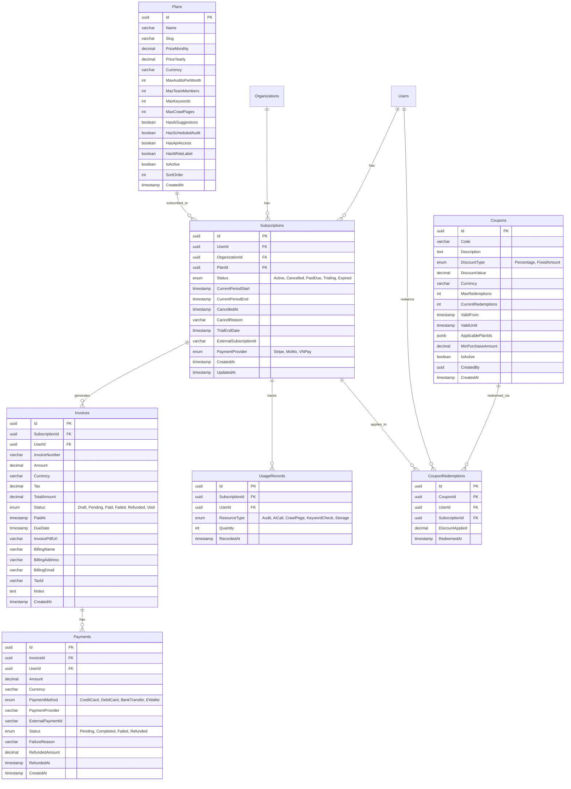

**Bảng chi tiết cột (Mẫu bảng Plans & Subscriptions):**

| Bảng | Cột | Kiểu dữ liệu | Ràng buộc | Mô tả |
| :--- | :--- | :--- | :--- | :--- |
| **Plans** | Id | uuid | PK | Khóa chính |
| | Name, Slug | varchar(255) | NOT NULL, UNIQUE(Slug) | Tên gói cước và đường dẫn tĩnh |
| | PriceMonthly, PriceYearly | decimal(10,2) | NOT NULL | Giá gói theo tháng/năm |
| | MaxAuditsPerMonth... | int | NOT NULL | Giới hạn tài nguyên của gói |
| | HasAiSuggestions... | boolean | DEFAULT false | Các cờ (flags) tính năng |
| **Subscriptions** | Id | uuid | PK | Khóa chính |
| | UserId / OrgId | uuid | FK, NULLABLE | Id người dùng hoặc Tổ chức sở hữu (Một trong hai phải có) |
| | PlanId | uuid | FK, NOT NULL | Tham chiếu tới bảng Plans |
| | Status | enum | NOT NULL | Trạng thái gói cước (Active, Cancelled...) |
| | CurrentPeriodEnd | timestamp | NOT NULL | Ngày hết hạn chu kỳ hiện tại |
| | ExternalSubscriptionId | varchar(255) | | ID do hệ thống thanh toán (VD: Stripe) cấp |

**Indexes quan trọng:**
- `idx_subscriptions_user_org`: `(UserId, OrganizationId)`
- `idx_subscriptions_status`: `(Status)`
- `idx_invoices_subscription`: `(SubscriptionId)`
- `idx_coupons_code`: `(Code)` - UNIQUE

#### 7.4.2. Team & Organization Service DB

Quản lý tổ chức doanh nghiệp, thành viên, phân quyền và log hoạt động.

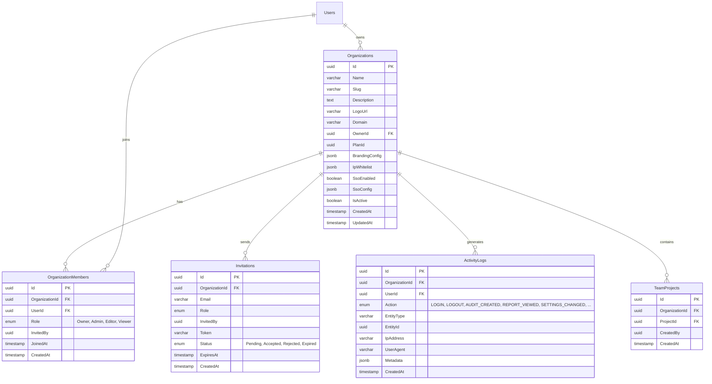

**Bảng chi tiết cột:**

| Bảng | Cột | Kiểu dữ liệu | Ràng buộc | Mô tả |
| :--- | :--- | :--- | :--- | :--- |
| **Organizations** | Id | uuid | PK | Khóa chính |
| | Slug | varchar(255) | UNIQUE, NOT NULL | Định danh đường dẫn (VD: acme-corp) |
| | BrandingConfig | jsonb | | Cấu hình White-label (màu sắc, logo) |
| **OrganizationMembers** | Role | enum | NOT NULL | Vai trò RBAC (Owner, Admin, Editor, Viewer) |
| | OrganizationId, UserId | uuid | FK, UNIQUE(OrgId, UserId) | Đảm bảo 1 user chỉ join 1 lần vào 1 Org |
| **ActivityLogs** | Action | enum | NOT NULL | Hành động được thực hiện |
| | Metadata | jsonb | | Thông tin bổ sung dạng JSON |

**Indexes quan trọng:**
- `idx_org_members_user`: `(UserId)`
- `idx_invitations_token`: `(Token)` - UNIQUE
- `idx_activity_logs_org_time`: `(OrganizationId, CreatedAt DESC)`

#### 7.4.3. Scheduler Service DB

Quản lý lịch trình tự động và tác vụ xử lý hàng loạt.

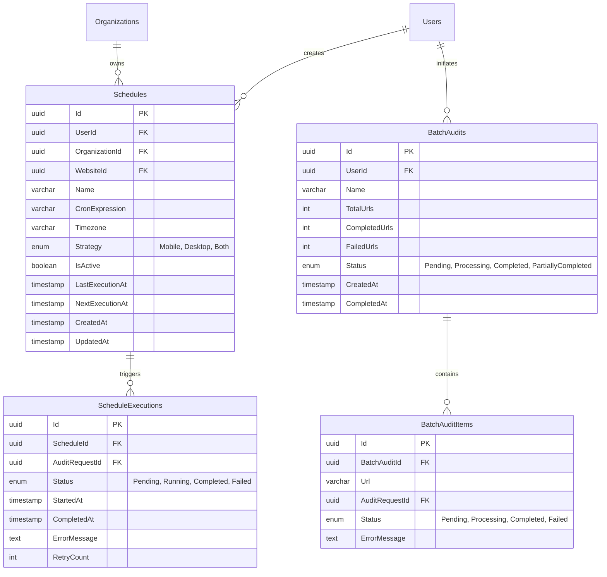

**Indexes quan trọng:**
- `idx_schedules_next_execution`: `(NextExecutionAt)` (Tối ưu cho Cron worker khi quét lịch cần chạy)
- `idx_schedule_executions_schedule`: `(ScheduleId, StartedAt DESC)`
- `idx_batch_audit_items_batch`: `(BatchAuditId, Status)`

#### 7.4.4. Site Crawler Service DB

Quản lý dữ liệu từ việc thu thập (crawling) website ở diện rộng.

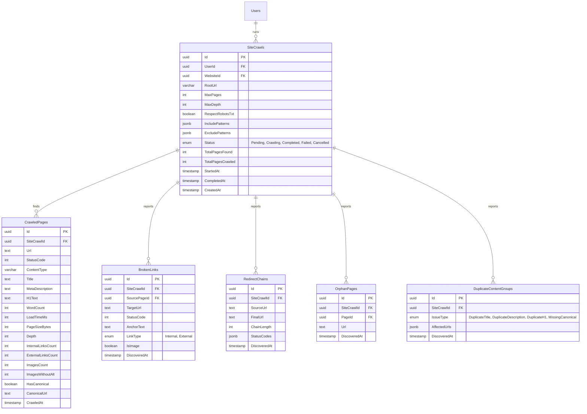

**Lưu ý thiết kế:**
- Cấu trúc DB này sinh ra lượng dữ liệu rất lớn. Tại production, bảng `CrawledPages` và `BrokenLinks` nên được Partitioning (Phân mảnh) theo `SiteCrawlId` hoặc ngày tháng, hoặc chuyển sang lưu trữ tại NoSQL (MongoDB) / Data Warehouse (ClickHouse) đối với các website hàng triệu pages.
- Khóa ngoại (FK) từ các bảng con lên `SiteCrawlId` cần có index để hỗ trợ CASCADE DELETE.

#### 7.4.5. Keyword Tracking Service DB

Theo dõi vị trí (Rankings) của website và đối thủ trên các Search Engine (SERP).

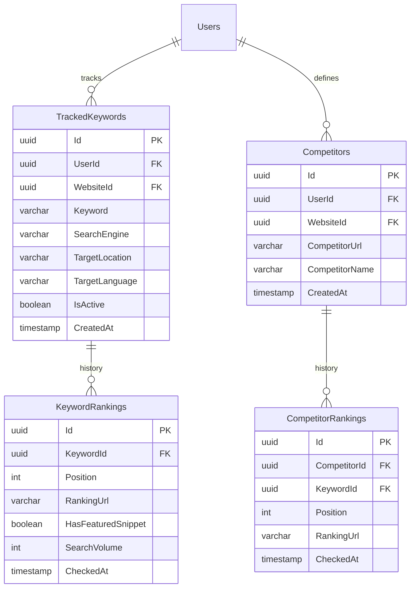

**Indexes quan trọng:**
- `idx_keyword_rankings_date`: `(KeywordId, CheckedAt DESC)` (Tối ưu để vẽ biểu đồ line chart lịch sử)

#### 7.4.6. Integration Service DB

Quản lý kết nối bên ngoài, Webhook và cấp phát API Key.

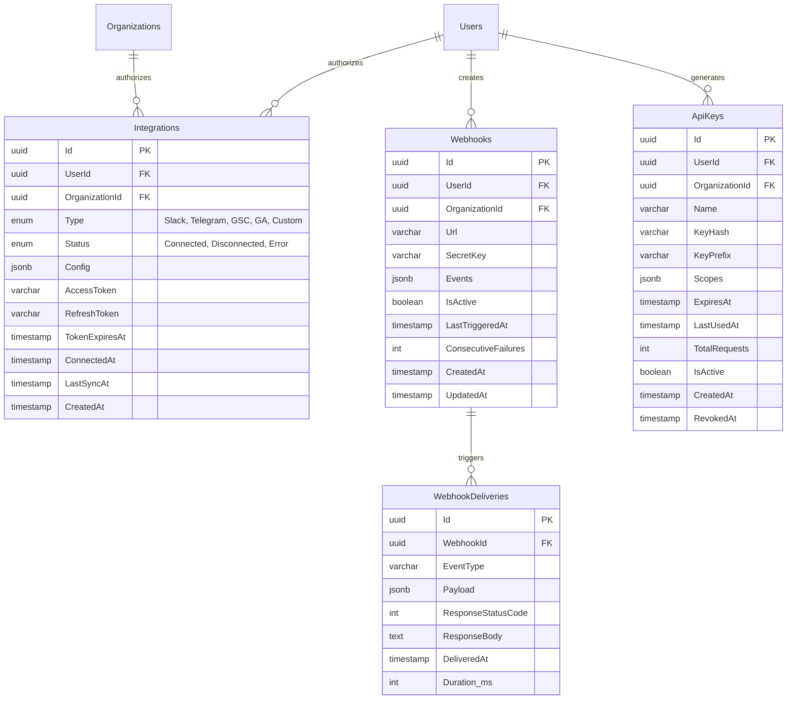
**Lưu ý bảo mật:**
- Cột `AccessToken` và `RefreshToken` trong bảng `Integrations` phải được mã hóa (Encrypted) ở tầng ứng dụng (Application Layer) trước khi lưu vào DB bằng AES-256-GCM.
- Bảng `ApiKeys`: Khóa bí mật (Secret Key) chỉ trả về một lần duy nhất lúc khởi tạo cho User, DB chỉ lưu mã băm `KeyHash` (sử dụng thuật toán như bcrypt, Argon2 hoặc SHA-256 tùy vào yêu cầu performance xác thực) và hiển thị `KeyPrefix` (vd: `seo_live_abc1...`) trên UI.

---

### 6.7. API Endpoints bổ sung cho các Service hiện tại

Bổ sung các endpoints cho các Core Services hiện tại nhằm đáp ứng yêu cầu của phiên bản Enterprise.

#### 6.7.1. Bổ sung cho Audit Service

Phân tích chuyên sâu (Deep Diagnostics).

| HTTP Method | Endpoint | Mô tả | 
| :--- | :--- | :--- | 
| **GET** | `/api/audits/{id}/accessibility` | Phân tích chi tiết mức độ tiếp cận (Accessibility - a11y) theo chuẩn WCAG. |
| **GET** | `/api/audits/{id}/security-headers` | Kiểm tra chi tiết các cấu hình Security Headers (HSTS, CSP, X-Frame-Options...). |
| **GET** | `/api/audits/{id}/resources` | Phân tích waterfall tốc độ tải, dung lượng từng tài nguyên (JS/CSS/Images). |
| **GET** | `/api/audits/{id}/screenshots` | Lấy hình ảnh Screenshot trước và sau khi trang load xong (để phân tích CLS, LCP). |
| **POST** | `/api/audits/{id}/rerun` | Chạy lại nguyên bài kiểm tra với cấu hình tương tự. |

#### 6.7.2. Bổ sung cho Report Service

Tùy biến báo cáo, chia sẻ (Collaboration) và Dashboard tĩnh.

| HTTP Method | Endpoint | Mô tả | 
| :--- | :--- | :--- | 
| **GET** | `/api/reports/compare` | Query `?ids=id1,id2`. So sánh sự khác biệt (Diff) giữa 2 bản báo cáo của cùng 1 URL. |
| **POST** | `/api/reports/templates` | Người dùng tạo mẫu báo cáo tùy chỉnh (chọn/bỏ chọn các modules cần hiển thị). |
| **GET** | `/api/reports/templates` | Lấy danh sách Report Templates của người dùng. |
| **GET** | `/api/reports/{id}/share` | Lấy thông tin link chia sẻ hiện tại (nếu có). |
| **POST** | `/api/reports/{id}/share` | Khởi tạo Share Token (VD: tạo link public có thời hạn, hoặc yêu cầu mật khẩu). |
| **GET** | `/api/shared/{token}` | API public (Không Auth) để lấy nội dung báo cáo dành cho khách (Khách hàng của người dùng). |
| **GET** | `/api/reports/dashboard/widgets` | Lấy cấu hình các Widgets hiển thị trên Dashboard chính. |
| **PUT** | `/api/reports/dashboard/widgets` | Lưu lại Layout các Widgets do người dùng kéo thả tùy biến. |

#### 6.7.3. Bổ sung cho Notification Service

Quản lý cấu hình thông báo chi tiết và giám sát uptime.

| HTTP Method | Endpoint | Mô tả | 
| :--- | :--- | :--- | 
| **GET** | `/api/notifications/preferences` | Lấy tùy chọn nhận thông báo (Email, Slack, Push Notification) cho từng loại sự kiện. |
| **PUT** | `/api/notifications/preferences` | Cập nhật tùy chọn nhận thông báo. |
| **POST** | `/api/notifications/mark-all-read` | Đánh dấu toàn bộ thông báo in-app là đã đọc. |
| **DELETE**| `/api/notifications` | Xóa (Clear) toàn bộ thông báo cũ. |
| **GET** | `/api/uptime-monitors/{id}/availability` | Lấy tỷ lệ % Uptime (Availability) theo tháng/năm của tính năng giám sát website. |
| **GET** | `/api/uptime-monitors/{id}/response-time` | Lấy dữ liệu time-series vẽ biểu đồ tốc độ phản hồi (Response time) của máy chủ website. |

#### 6.7.4. Bổ sung cho Identity & Admin Service

Bộ công cụ dành cho System Administrator để vận hành hệ thống SaaS.

| HTTP Method | Endpoint | Mô tả (Chỉ Admin) | 
| :--- | :--- | :--- | 
| **GET** | `/api/admin/analytics` | Thống kê tổng quan hệ thống: DAU (Daily Active Users), MAU, Doanh thu, Tỷ lệ Churn. |
| **GET** | `/api/admin/audit-log` | System-wide Audit Log: Nhật ký mọi hành động thay đổi cấu hình quan trọng trên toàn hệ thống. |
| **POST** | `/api/admin/announcements` | Tạo thông báo hệ thống (Sẽ hiển thị popup hoặc banner trong app cho tất cả người dùng). |
| **GET** | `/api/admin/subscriptions` | Bảng điều khiển xem toàn bộ thông tin gói cước, lọc theo trạng thái (Active/PastDue). |
| **PUT** | `/api/admin/users/{id}/plan` | Ghi đè (Override) gói cước của một người dùng cụ thể (dành cho bộ phận Customer Support). |
| **GET** | `/api/admin/reports/revenue` | Báo cáo doanh thu tài chính chi tiết (MRR, ARR) theo từng mốc thời gian. |
| **GET** | `/api/admin/reports/usage` | Báo cáo tình hình tiêu thụ tài nguyên hệ thống (CPU, Worker jobs, Storage) để lên kế hoạch scale server. |

---
*Tài liệu này được định dạng theo tiêu chuẩn IEEE 830 mở rộng, phục vụ trực tiếp cho quá trình đánh giá, phân tích thiết kế hệ thống và triển khai đồ án tốt nghiệp.*

---

## 7. Thiết kế Cơ sở dữ liệu (Database Design)

Mỗi microservice sở hữu cơ sở dữ liệu (PostgreSQL) độc lập theo nguyên tắc Database-per-service pattern.

### 7.1. Sơ đồ ERD tổng quan

#### 1. Identity Service DB
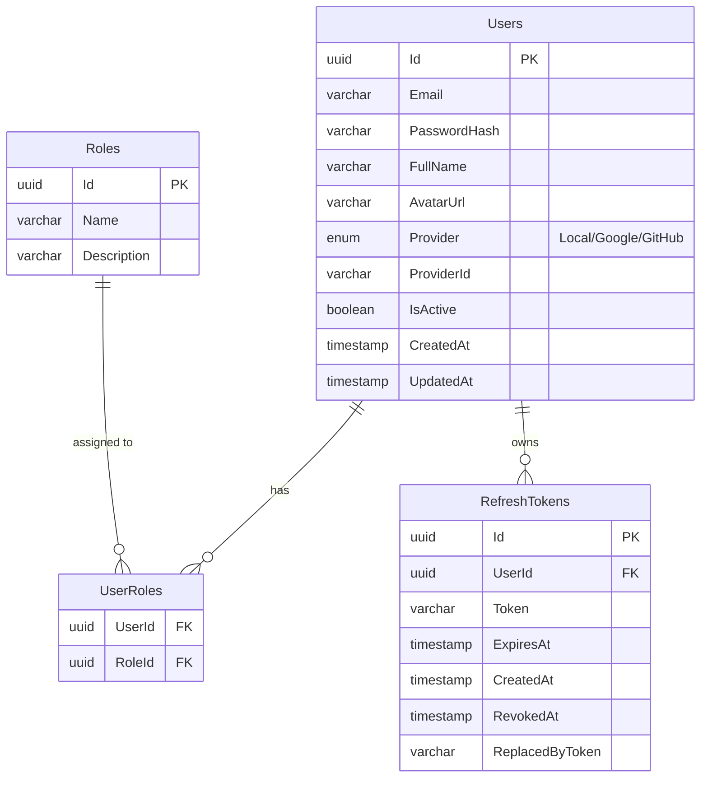

#### 2. Audit Service DB
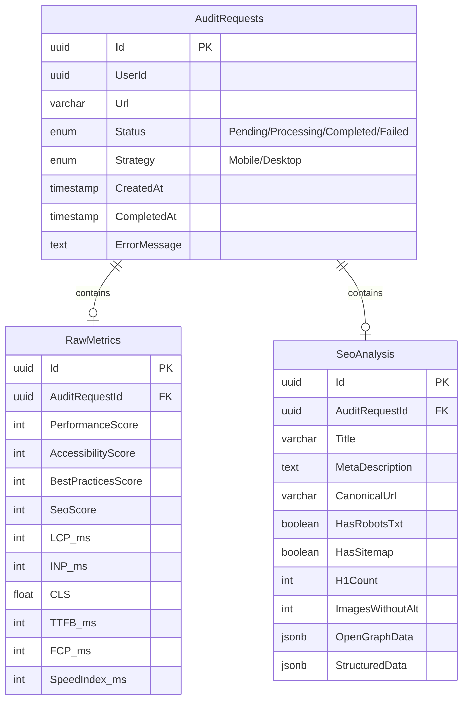

#### 3. AI Service DB
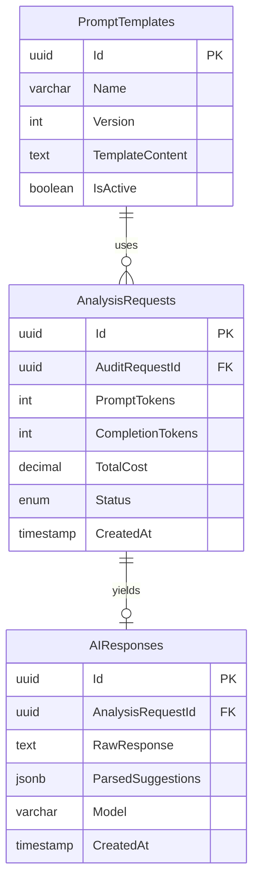

#### 4. Report Service DB
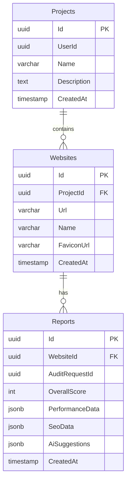

#### 5. Notification Service DB
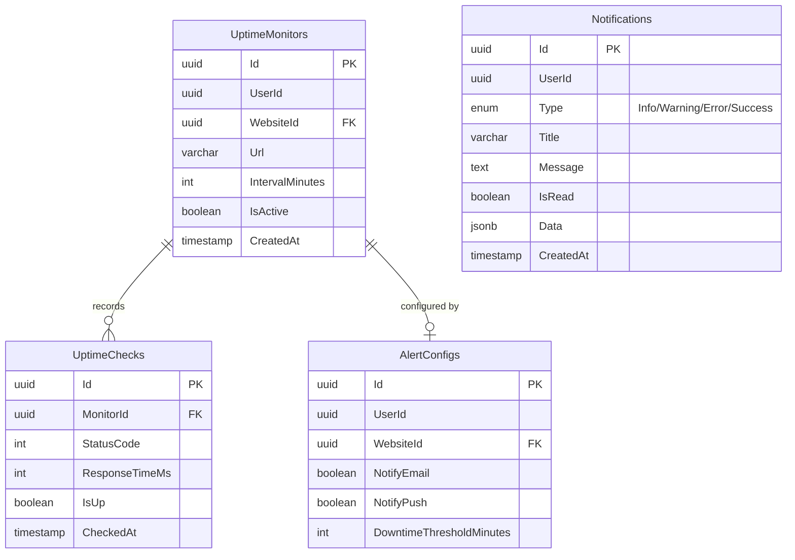

### 7.2. Mô tả chi tiết các bảng (Bảng điển hình: AuditRequests)

| Cột | Kiểu dữ liệu (PostgreSQL) | Ràng buộc | Mô tả |
| :--- | :--- | :--- | :--- |
| `Id` | `UUID` | PRIMARY KEY | Khóa chính tự sinh |
| `UserId` | `UUID` | NOT NULL, INDEX | ID của người dùng khởi tạo request |
| `Url` | `VARCHAR(2048)` | NOT NULL | URL cần audit |
| `Status` | `VARCHAR(20)` | NOT NULL, DEFAULT 'Pending' | Trạng thái xử lý (Pending/Processing...) |
| `Strategy` | `VARCHAR(10)` | NOT NULL | Chiến lược đánh giá (Mobile/Desktop) |
| `CreatedAt` | `TIMESTAMP` | DEFAULT NOW() | Thời gian khởi tạo |
| `CompletedAt` | `TIMESTAMP` | NULL | Thời gian hoàn tất (hoặc fail) |
| `ErrorMessage` | `TEXT` | NULL | Chi tiết lỗi nếu Status = Failed |

> [!TIP]
> Các cấu trúc JSON (như `OpenGraphData`, `ParsedSuggestions`) sẽ được lưu dưới kiểu dữ liệu `JSONB` của PostgreSQL để tối ưu việc indexing và query bên trong JSON document.

### 7.3. Index Strategy
Để tối ưu hóa hiệu năng truy vấn, các indexes sau được thiết lập:
* **B-Tree Indexes**: 
  * `AuditRequests.UserId`, `Projects.UserId` (Tra cứu dữ liệu theo User).
  * `Reports.WebsiteId`, `Websites.ProjectId` (Các foreign keys thường xuyên join hoặc lọc).
  * `RefreshTokens.Token` (Xác thực token nhanh).
* **Compound Indexes**:
  * `AuditRequests(UserId, CreatedAt DESC)`: Hỗ trợ query danh sách audit gần nhất của user.
  * `UptimeChecks(MonitorId, CheckedAt DESC)`: Truy vấn nhanh biểu đồ uptime theo thời gian.
* **GIN Indexes**:
  * `Reports.AiSuggestions` (nếu cần tìm kiếm full-text trên nội dung đề xuất AI).

---

## 8. Thiết kế Giao diện Người dùng (UI/UX Design)

### 8.1. Sitemap ứng dụng
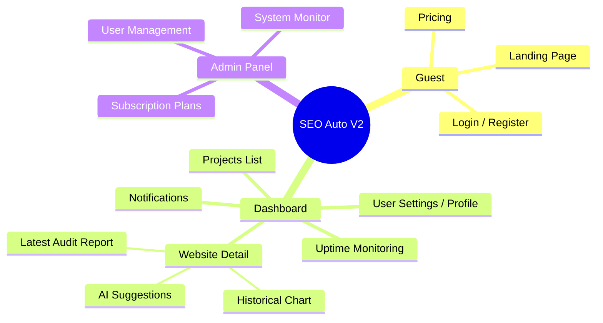

### 8.2. Mô tả các màn hình chính

1. **Dashboard - Projects List**:
   * **Layout**: Sidebar điều hướng bên trái, phần chính hiển thị dạng grid hoặc list các dự án.
   * **Component chính**: Thẻ (Card) Dự án kèm biểu đồ mini xu hướng điểm số, Nút "Add New Project", Thanh tìm kiếm.
   * **Action**: Create/Edit/Delete Project, Click vào dự án để xem chi tiết websites.
2. **Website Detail & Latest Report**:
   * **Layout**: Màn hình dài với các section khác nhau. Trên cùng là thanh thao tác nhanh.
   * **Component chính**: 
     * Khối Điểm Tổng quan (Gauge charts cho Performance, Accessibility, Best Practices, SEO).
     * Khối Core Web Vitals (LCP, FID, CLS) hiển thị xanh/vàng/đỏ.
     * Tab **AI Suggestions**: Trình bày các vấn đề và giải pháp dạng Accordion. Có nút "Fix this for me" (Copy code).
   * **Action**: "Re-audit Now", Xuất PDF, Chia sẻ link báo cáo.
3. **Uptime Monitor**:
   * **Layout**: Dạng danh sách bảng kèm biểu đồ dạng Heatmap/Sparkline.
   * **Data**: Danh sách URL đang theo dõi, trạng thái UP/DOWN (badge xanh/đỏ), Response time trung bình.

### 8.3. Chrome Extension UI
* **Popup Layout**: Thiết kế nhỏ gọn (chiều rộng 400px, chiều cao tối đa 600px).
* **Trạng thái chưa Login**: Hiển thị form Login/Register nhanh.
* **Trạng thái đã Login**: 
  * **Header**: Logo, User Avatar.
  * **Body**: Tên Tab hiện tại, nút CTA to rõ "Analyze Current Page".
  * **Kết quả**: Sau khi phân tích, hiển thị 4 mini score cards (Perf, Acc, BP, SEO). Các cảnh báo nghiêm trọng nhất (Critical Issues) sẽ hiện list ngắn gọn bên dưới. Có link "View Full Report on Dashboard".
  * **Badge**: Icon extension trên thanh trình duyệt có badge màu đỏ hiển thị số lỗi SEO phát hiện được.

---

## 9. Ma trận Truy vết Yêu cầu (Requirements Traceability Matrix)

| Req ID | Mô tả Yêu cầu (Use Case) | API Endpoint | Database Table | Test Case ID |
| :--- | :--- | :--- | :--- | :--- |
| FR-001 | Đăng ký tài khoản người dùng | `POST /api/auth/register` | `IdentityDB.Users` | TC-001, TC-002 |
| FR-002 | Xác thực đăng nhập (Login) | `POST /api/auth/login` | `IdentityDB.RefreshTokens` | TC-003, TC-004 |
| FR-003 | Gửi yêu cầu Audit URL mới | `POST /api/audits` | `AuditDB.AuditRequests` | TC-005, TC-006 |
| FR-004 | Phân tích metrics bằng PageSpeed | (Background Worker) | `AuditDB.RawMetrics` | TC-007 |
| FR-005 | Đề xuất tối ưu bằng AI | (Background Worker) | `AI_DB.AIResponses` | TC-008 |
| FR-006 | Quản lý Dự án (CRUD) | `GET,POST,PUT /api/projects` | `ReportDB.Projects` | TC-009 |
| FR-007 | Quản lý Websites trong Dự án | `GET,POST /api/websites` | `ReportDB.Websites` | TC-010 |
| FR-008 | Xem chi tiết báo cáo Audit | `GET /api/reports/{auditId}`| `ReportDB.Reports` | TC-011 |
| FR-009 | Xuất file PDF báo cáo | `GET /api/reports/../export/pdf`| `ReportDB.Reports` | TC-012 |
| FR-010 | Giám sát Uptime tự động | `POST /api/uptime-monitors` | `NotificationDB.Monitors` | TC-013 |
| FR-011 | Gửi cảnh báo khi website down | (Background Worker) | `NotificationDB.Notifications` | TC-014 |
| NFR-004| Dashboard tải nhanh < 3s | (Frontend Client) | N/A | TC-015 |
| NFR-014| Phân quyền bằng JWT | Tất cả các API có (Auth) | N/A | TC-016 |
| NFR-016| Rate Limiting API | API Gateway Middleware | Redis (Cache) | TC-017 |
| NFR-022| Structured Logging | Tất cả Services | N/A | TC-018 |

---

## 10. Kế hoạch Kiểm thử (Testing Strategy)

### 10.1. Phân loại kiểm thử
* **Unit Testing**: Sử dụng `xUnit` kết hợp `Moq`/`NSubstitute` cho backend (C#) và `Jest` cho frontend. Tập trung vào domain logic và các services.
* **Integration Testing**: Sử dụng thư viện `TestContainers` để spin-up các Docker container thực (PostgreSQL, RabbitMQ, Redis) để test sự giao tiếp giữa repositories và database, hoặc event publishing.
* **API Testing**: Dùng thư mục `Postman` hoặc mã hóa dưới dạng code (sử dụng RestSharp) chạy tự động qua `Newman` trong CI pipeline.
* **E2E Testing**: Viết test bằng `Playwright` giả lập hành vi người dùng (Đăng nhập -> Thêm URL -> Đợi Audit -> Xem kết quả) trên trình duyệt thực.
* **Performance Testing**: Dùng `k6` tạo tải mô phỏng hàng trăm concurrent users gọi vào API Gateway để đảm bảo NFR-001 và NFR-002.

### 10.2. Test Cases mẫu

| TC ID | Requirement | Mô tả | Input (Ví dụ) | Expected Output | Loại |
| :--- | :--- | :--- | :--- | :--- | :--- |
| **TC-001** | FR-001 | Đăng ký thành công | Email hợp lệ, pass mạnh | HTTP 201, Record tạo trong DB | API |
| **TC-002** | FR-001 | Đăng ký trùng email | Email đã tồn tại | HTTP 400 Bad Request | API |
| **TC-003** | FR-002 | Login sai thông tin | Sai mật khẩu | HTTP 401 Unauthorized | API |
| **TC-005** | FR-003 | Submit URL audit hợp lệ | `{"url": "https://google.com"}` | HTTP 202, Message đẩy vào Queue | E2E |
| **TC-006** | FR-003 | Submit URL không hợp lệ | `{"url": "not-a-url"}` | HTTP 400 Validation Error | Unit |
| **TC-007** | FR-004 | Xử lý audit lưu DB | Message trong RabbitMQ | Dữ liệu cập nhật vào `RawMetrics` | Integration |
| **TC-008** | FR-005 | Fallback AI lỗi | Gọi AI Service, mock Timeout | Status Success, `AiSuggestions` rỗng | Integration |
| **TC-011** | FR-008 | User xem báo cáo của người khác | Token user A, ID báo cáo user B | HTTP 403 Forbidden | API |
| **TC-013** | FR-010 | Tạo Uptime Monitor | `{"intervalMinutes": -1}` | HTTP 400 Validation Error | Unit |
| **TC-017** | NFR-016 | Test Rate Limit | Gọi API Login 11 lần/phút | Lần thứ 11 trả HTTP 429 Too Many Req | Perf |

### 10.3. Tiêu chí hoàn thành (Definition of Done - DoD)
* Code đã được review và merge vào branch `develop`/`main`.
* Unit Test coverage đạt mức tối thiểu 70% và tất cả test cases (Unit/Integration) đều PASS (Xanh).
* Frontend UI hiển thị đúng thiết kế trên Figma và Responsive đúng chuẩn.
* API Endpoint đã được cập nhật tài liệu trên SwaggerUI.
* Đã vượt qua các bước scan mã độc, lỗ hổng tự động (SonarQube).

---

## 11. Phụ lục (Appendices)

### 11.1. Cấu trúc thư mục dự án (Project Structure - Ví dụ Audit Service)
Dự án áp dụng Vertical Slice Architecture. Mỗi thư mục Features chứa toàn bộ logic liên quan (Command/Query, Handler, DTO, Validator).

```text
AuditService/
├── src/
│   ├── AuditService.Api/
│   │   ├── Controllers/
│   │   ├── Program.cs
│   ├── AuditService.Application/
│   │   ├── Features/
│   │   │   ├── SubmitAudit/
│   │   │   │   ├── SubmitAuditCommand.cs
│   │   │   │   ├── SubmitAuditHandler.cs
│   │   │   │   ├── SubmitAuditValidator.cs
│   │   │   ├── GetAuditResult/
│   │   │   │   ├── GetAuditQuery.cs
│   │   │   │   ├── GetAuditHandler.cs
│   │   ├── Common/ (Interfaces, Exceptions)
│   ├── AuditService.Infrastructure/
│   │   ├── Persistence/ (DbContext, Migrations)
│   │   ├── MessageBrokers/ (RabbitMQ Publishers)
│   │   ├── ExternalServices/ (PageSpeed API Client)
├── tests/
│   ├── AuditService.UnitTests/
│   ├── AuditService.IntegrationTests/
```

### 11.2. Cấu hình Docker Compose mẫu
```yaml
version: '3.8'
services:
  api-gateway:
    image: seo-api-gateway:latest
    ports:
      - "8080:80"
    depends_on:
      - identity-service
      - audit-service

  audit-service:
    image: seo-audit-service:latest
    environment:
      - ConnectionStrings__Default=Host=postgres;Database=AuditDb...
      - RabbitMQ__Host=rabbitmq
    depends_on:
      - postgres
      - rabbitmq

  postgres:
    image: postgres:15-alpine
    environment:
      POSTGRES_PASSWORD: "ComplexPassword123"
    ports:
      - "5432:5432"

  rabbitmq:
    image: rabbitmq:3.12-management
    ports:
      - "5672:5672"
      - "15672:15672"

  redis:
    image: redis:7-alpine
    ports:
      - "6379:6379"
```

### 11.3. Danh sách công nghệ sử dụng

| Thành phần | Công nghệ / Ngôn ngữ | Phiên bản | Mục đích áp dụng |
| :--- | :--- | :--- | :--- |
| **Backend Framework** | .NET 8 / C# 12 | 8.0 | Phát triển các RESTful APIs và Microservices hiệu suất cao. |
| **API Gateway** | YARP (Yet Another Reverse Proxy) | 2.1 | Định tuyến request, Load Balancing, Rate Limiting, Authentication trung tâm. |
| **Database** | PostgreSQL | 15.x | RDBMS chính lưu trữ dữ liệu nghiệp vụ nhờ tính ổn định và hỗ trợ JSONB mạnh mẽ. |
| **Message Broker** | RabbitMQ + MassTransit | 3.12 | Quản lý event-driven architecture, liên lạc bất đồng bộ giữa các services (Pub/Sub). |
| **Caching** | Redis | 7.0 | Cache dữ liệu tạm, kết quả báo cáo và distributed caching (Rate limiting). |
| **Frontend Web** | Next.js + React | 14.x | Xây dựng Dashboard chuẩn SEO, SSR và tăng tốc độ tương tác người dùng. |
| **UI Library** | TailwindCSS + Shadcn/ui | 3.4 | Dựng giao diện nhanh chóng, nhất quán, dễ dàng custom. |
| **AI Integration** | Google Gemini API | Pro/Flash | Phân tích dữ liệu SEO thô và đưa ra các đề xuất tối ưu (Suggestions). |
| **Audit Engine** | Google PageSpeed Insights API | V5 | Thu thập chỉ số hiệu năng thực tế (Core Web Vitals) và chấm điểm Lighthouse. |
| **Container & Orchestration** | Docker & Docker Compose | 24+ | Đóng gói môi trường đồng nhất. Triển khai cục bộ và production. |
| **CI/CD** | GitHub Actions | N/A | Tự động hóa build, test mã nguồn và pipeline deploy. |

---
*Tài liệu Đặc tả Yêu cầu Phần mềm này được biên soạn cho dự án Đồ án tốt nghiệp SEO-Auto-V2. Mọi thay đổi trong yêu cầu phải được cập nhật và duy trì version control thông qua hệ thống Git.*
